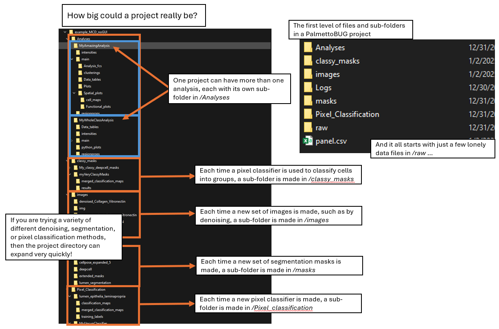
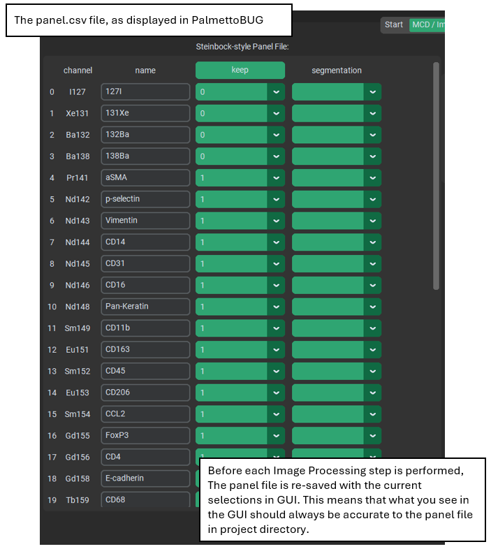
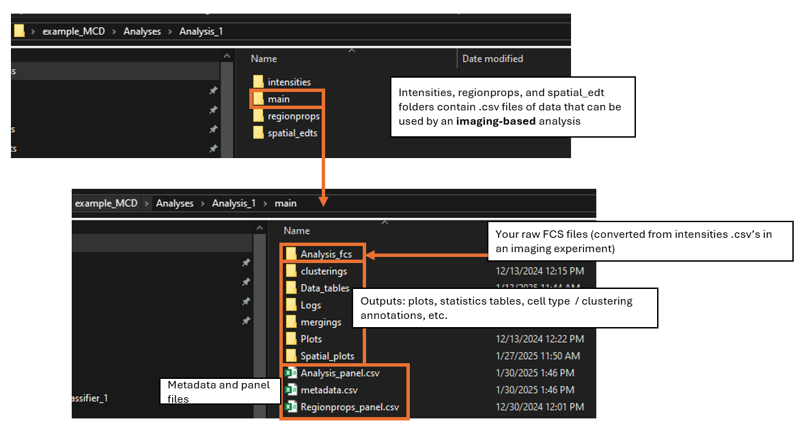
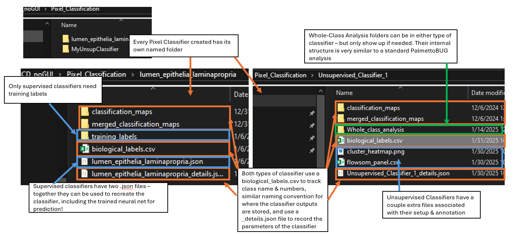
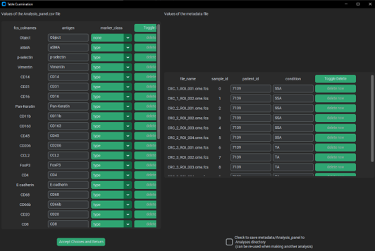
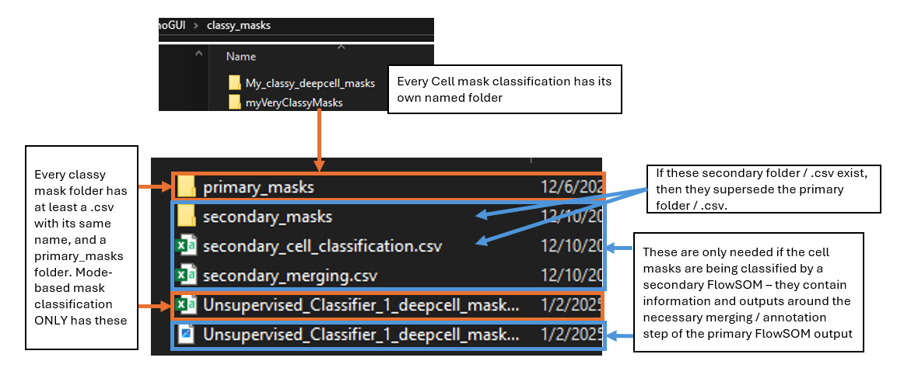

Advanced PalmettoBUG and its Directory Structure
================================================

This page of the documentation is meant to help with understanding the
directory structure and data table files of PalmettoBUG and particularly
with troubleshooting the program or using the program with other
software.

.. note:: 

   The “HackingPalmettoBUG” slide deck inside the GitHub / PalmettoBUG package is an even more thorough, **animated** documentation
   resource for understanding the various directories of the program.

The Imaging Project Directory
~~~~~~~~~~~~~~~~~~~~~~~~~~~~~

The directory is a key structure in a PalmettoBUG project - it is where
data is expected to be read from, and where data is saved in expected
locations for later use. This well-defined structure is how
PalmettoBUG can often easily re-enter an experiment at the same step
where you left off last time. Knowing how PalmettoBUG reads & writes to
this directory -- and where data is expected to be found and in what
format -- can be very helpful for understanding errors and troubleshooting
issues with your project, as well as for mix-and-matching PalmettoBUG
inputs / outputs with other data analysis pipelines.

|image1|

The upper level of an imaging project includes a number of folders, as
well as a single file (panel.csv). However, to begin a project, only the
*/raw* subfolder, containing the starting data files (TIFF or MCD) is
necessary, with the rest of the directory being populated as the
analysis is performed.

On creating a project, other folders in this directory are created
including */images, /masks, /Pixel_Classification, /classy_masks,* and
/*Analyses*.

   1). The */images* folder contains subfolders of images as .tiff
   files. Within it, the */images/img* is a special subfolder containing
   the images directly converted from the raw folder. Other folders of
   images can be made by the user with custom names - for example after
   denoising or other image modifications.

..

   2). The /*masks* folder contains subfolders of cell masks as .tiff
   files. */masks/cellpose_masks* and */masks/deepcell_masks* are
   special sub-folders containing the cell masks generated by cellpose /
   deepcell algorithms, respectively. Other subfolders can be generated
   by the user by modifying those masks or by using pixel classifiers.

   3). *Pixel_Classification* contains subfolders, each dedicated to a
   particular pixel classifier. Each classifier folder contains not only
   the primary outputs of the classifier - folder(s) of .tiff files with
   the predicted classes for each input image - but also a variety of
   other folders and files that provide information about the classifier
   (such as .json files containing the parameters of the classifier, or
   a folder of user-annotated images for training supervised
   classifiers).

..

   4). C\ *lassy_masks* contains subfolders for every time you classify
   cell masks into cell types / groups using a pixel classifier. This
   means a folder of “classy masks”, which are cell masks (.tiff files)
   that have been grouped by the pixel classifier into a few categories.
   There is also a table of these cell classifications, one for entry
   for every cell masks, that can be imported into an analysis. This
   serves as an alternative way to cluster / label cell types.

   5). *Analyses* contains ‘analysis’ sub-folders, each with data
   measured from the images for clustering, plotting, etc. Each analysis
   folder has the same structure as an “FCS directory” project and once
   created can be entered directly from the starting screen.

Images and Masks sub-folder are fairly simple and need little
explanation. They only contain images as .tiff files, all with the same
filename for each ROI across all folders. In general, PalmettoBUG
automatically uses the filename of the source image / ROI when writing a
new .tiff file - this convention is critical because it is how images /
masks / pixel classes, etc. are matched together - so if you make edits
or add data to a PalmettoBUG project, **be sure that this convention is
maintained.**

The */Analyses*, */Pixel_classification*, and */classy_masks* sub-folder
has more complex internal structures, and will be discussed in greater
detail later in this document.

The */panel.csv* file is also critical, and improper values in it can be
a source of common errors. It is composed of 4 columns, the first two
dedicated to the names of the channels in the */raw* dataset, and the
second two dedicated to how they will be used.

|image2|

The first column are the labels for the channels that can be derived
*/raw* data, usually the metal channels themselves if derived from MCD
files. The second column is meant to be the biologically useful labels
for the channels and sometimes needs editing, if the labels in the
*/raw* dataset are missing or unhelpful.

The third column, “keep” is where things get more complicated and more
important. It defines what channels in */raw* will be carried over into
the rest of the PalmettoBUG project. Critically, PalmettoBUG uses the
order of the channels in the images in order to match channels to their
labels, so **the** **order & number of channels in the images themselves
is incredibly important.** This order is changed by what channel are
kept, and those changes are tracked by the panel file. This is why
editing the “keep” column after converting the data from */raw*, is very
risky - the order of the channels in the panel file is changed, while
the data itself is unchanged, creating a mismatch in expectation that
can create errors or inaccurate analysis! Only edit the “keep” column if
you intend to re-do all the steps of the pipeline, in order, immediately
afterwards.

The last column of the panel.csv file (“segmentation”) is only used by
the Cellpose / DeepCell segmentation options, in order to identify the
nuclear and cytoplasmic regions of cells in the images. This always must
be manually set by the user!

Analysis / FCS Directories
~~~~~~~~~~~~~~~~~~~~~~~~~~

The directory for each analysis within an imaging project (in the
*/Analyses* folder) is roughly the same as the directory for a
solution-mode / FCS project. They are so similar, in fact, that the
“Choose FCS directory” button on the starting page can be used to load
an individual analysis of an imaging project. Let’s get into the details
of how these directories work.

The critical component for launching an analysis directory, is the
presence of FCS files in the */main/Analysis_fcs* subfolder of the
directory. However, in imaging experiments, there are additional,
spatial information files required, and the FCS files themselves are
derived from .csv files read from the images & segmentation masks. These
additional data .csv files needed by imaging experiments are why
analysis directories have folders parallel with */main* (specifically,
*/intensities*, */regionprops*, and sometimes */spatial_edts*). However,
the meat of the analysis directory is contained inside the */main*
sub-folder - this is where plots, cell clusterings, and statistics
tables are written to as you perform your analysis.

|image3|

Sub-folder of */main*:

   1). */Analysis_fcs* is the starting folder with raw FCS files.

..

   2) */Clusterings* contains .csv files of cell clusterings /
   groupings.

   3). */Mergings* contains .csv files of the manual merging of FlowSOM
   clusters by the user.

..

   4). */Data\_tables* contains .csv files with data or statistics
   exported by the user for use outside PalmettoBUG.

   5). */Plots* contains the plots generated by PalmettoBUG.

..

   6). */Spatial_plots* contains the outputs of the spatial tab of the
   program - including plots AND statistics tables.

*Key CSV’s - metadata and Analysis_panel & regionprops_panel*

As described in the single-cell analysis page, when an analysis is run
two CSVs are necessary - an Analysis_panel file, which helps with the
handling of antigen names / classes, and a metadata file which handles
the experimental details of the samples in the dataset. If you choose to
load region properties into the analysis, then a regionprops_panel.csv
will also be created - this contains the name / marker_class of the
regionproperties being added to the data.

|image4|

If you are familiar with the anndata structure in Python (https://anndata.readthedocs.io/en/stable/) — which is the
primary data structure inside the PalmettoBUG analysis modules — you may
recognize the information in the metadata file as being part of
*anndata.obs*, and the information in the panel file(s) as part of *anndata.var*.

Pixel Classifier and Classy Mask folders
~~~~~~~~~~~~~~~~~~~~~~~~~~~~~~~~~~~~~~~~

Inside the */Pixel_classification* folder, each pixel classifier you
make will receives its own folder.

For both types of classifier folder, the initial output of the
classifier will be written to a */classification_maps* sub-folder, and
if any merging on biological labels is performed (the details of that
merging being in a *biological_labels.csv* file), the result of that
merging will be written to */merged_classification_maps*. Further, both
types of classifier have a {classifier_name}\ *\_details.json* file that
contains information about the setup and parameters of the classifier.

However, only supervised classifiers will have a second .json file -
containing the neural network information (including any training
weights, which allows prediction after reload) - and only these will
have a */training_labels* sub-folder. Unsupervised classifiers, on
the other hand, contain a parameter file (*flowsom_panel.csv*) absent in
supervised classifiers, as well as a *cluster_heatmap.png* containing a
useful heatmap plot for examining & annotating the expression of markers
in the primary, pre-annotation clusters.

|image5|

For either type of classifier, you may see a */Whole_class_analysis*
sub-folder. This contains a very similar structure to a normal
PalmettoBUG analysis directory, although it is also much simpler and
does not use FCS files at all (just intensity .csv’s are used). This
folder will only show up inside a classifier directory if needed.

*Classy Mask folders:*

Each time you classify a set of masks with a classifier, a new sub-folder is created in
*/classy_masks* to hold the output.

These subfolders contain, at minimum a */primary_masks* folder of
classified cell masks (.tiff files), and a .csv file with the same name
as the */classy_masks* subfolder, which contains the class assignments
for each cell mask. These are the only outputs for a cell mask
classifier using the “mode” method.

|image6|

However, classy masks made using a secondary FlowSOM have a number of
extra folders because of the need to annotate & merge the initial output
of the FlowSOM. This includes a */secondary_masks* and a
*secondary_cell_classification.csv* which contain the annotated cell
classes and supersede the primary outputs, as well as a heatmap file (PNG) 
that is used to assist in the annotation of the FlowSOM metaclusters.

For either classy masks or pixel classifiers, there can also be a sub-folder
of PNG files generated from the classification maps / classy masks (these can be
optionally created as an alternate way to visualize the .tiff files).

Examples of How to Use this Information
~~~~~~~~~~~~~~~~~~~~~~~~~~~~~~~~~~~~~~~

Knowing the directory structure can help in a couple main ways:

   1). Troubleshooting. If you encounter an error while running the
   program, it can be helpful to know where the program is looking for
   information. For example, if you encounter an error in the analysis
   portion of the program with a message related to a “patient_id”
   column - it may be useful to check the metadata.csv file inside
   *{*\ analysis name\ *}/main*, and see if the metadata file contains
   the expected information. Or, if you are performing a step requiring
   a folder of pixel classifier outputs, you could check that folder to
   be sure that there is a pixel classification for every image, and you
   did not accidently only predict for one or a few of the images.

   2). Combining PalmettoBUG with other software. One of the benefits
   of PalmettoBUG is that many of intermediate outputs of the program
   (like segmentation masks, pixel classifications, etc.) are
   automatically exported in common file formats like .tiff, allowing
   relatively easy integration of data between analysis pipelines, at
   certain steps of the program. But to be able to do this, you need
   to understand the PalmettoBUG directory to both find the data you
   want to take out of PalmettoBUG or to know where/how to try and
   insert the data you want to add to a PalmettoBUG project.

   For example, you may want to predict segmentation masks using a
   custom-trained Cellpose model, instead of the generalist models available in PalmettoBUg
   (a custom-trained model is likely to perform better than the base generalist model, if you
   want to invest the time to do the training, since it will have gained
   “experience” or your specific data!). This doesn’t mean you can’t use
   PalmettoBUG – all you have to do is take the predicted cell masks from your custom
   Cellpose model, and place them all as .tiff files (with the same
   filename / format as you would get from the Cellpose predictions in
   PalmettoBUG) into a subfolder of */masks*. 
   
   Or as an example in the opposite direction, if you just wanted the
   pixel classifier outputs from PalmettoBUG, and wanted to do most of 
   your analysis in another software, you can know to go to the appropriate
   folder inside */Pixel_classification* to find those classifier predictions, 
   and then copy those files to wherever you needed to for the other software.

