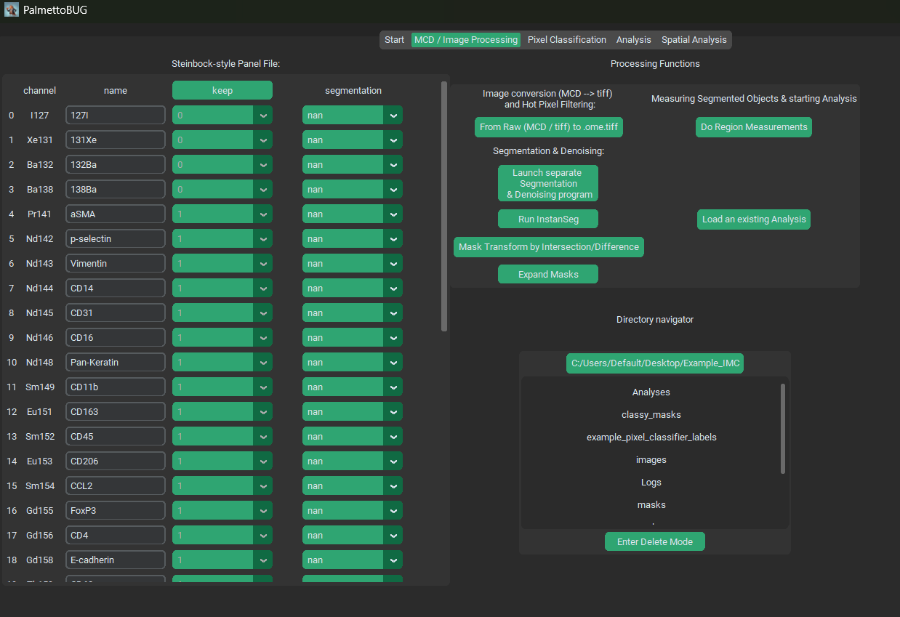
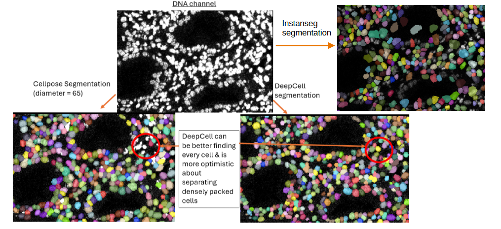

Image Processing
================

Once you have loaded data into an imaging experiment (whether by .tiff
or by .mcd files), the GUI should automatically switch to the next,
image processing tab:

|image1|

The Panel 
~~~~~~~~~~

On the left half of the GUI you should see the :ref:`steinbock <Links1>`-style Panel
file, with four columns. Each column serves a different purpose:

1. Channel – this column cannot be edited in the GUI, and represents the
   names of the channels in the dataset (derived either from the .mcd or
   .ome.tiff files’ metadata). This channel name can sometimes be not
   very helpful or biological, such as “Nd142Di”.
2. Name – this column is the biological name of the channel, like
   “CD45”. It determines how the channel is saved in the downstream .fcs
   / .csv files, and subsequent single-cell analysis plots.
3. Keep – this column is whether to drop a channel (keep = 0) or keep a
   channel ( = 1) when converting from the */raw* files to the first
   image folder. For example, .mcd files frequently contain channels
   (like BCKG190) that contain no useful information for downstream
   analysis. These can be dropped to reduce the computational size /
   burden of the image files and downstream analysis. This column should NEVER
   be changed after converting files from */raw,* unless you intend on
   re-doing that conversion and all downstream steps.
4. Segmentation – this column is an annotation of what channels to use
   in the segmentation models. Channels set to ‘nan’ or left blank will
   not be used in segmentation, while those used in segmentation will
   either be used as ‘nuclei’ channels or ‘cytoplasmic / membrane’
   channels. **There should be at least one channel set to nuclei and
   one set to cytoplasmic (Otherwise segmentation is likely to error /
   fail).**

When any step of the PalmettoBUG pipeline is performed that uses this
panel file, the panel file will be saved from its current state in the
GUI to the project directory, as “panel.csv”. Note that when saved to
the disk, ‘nuclei’ and ‘cytoplasmic / membrane’ are converted to numbers
(1 and 2).

Conversion from Raw to .ome.tiffs
~~~~~~~~~~~~~~~~~~~~~~~~~~~~~~~~~

Once you have set up your panel file (especially the keep column), you
can convert your starting data files from the */raw* folder into
.ome.tiffs in the */images/img* subfolder of the project directory.
Regardless of whether there are .mcd or .tiff files in the */raw*
folder, this step ALWAYS does at least two things:

1. Write every ROI as a single .ome.tiff image in the */images/img*
   subfolder of the project directory. When converting from .mcd’s this
   means that there will usually be more .ome.tiffs exported than
   original files, as .mcd’s can contain multiple ROIs. However, when
   “converting” from .tiff files, each individual .tiff in */raw* will
   create a single .ome.tiff in */images/img*.
2. Every channel with keep == 0 in the panel file will be dropped from
   the images exported to */images/img.* Importantly, this means there can be
   a difference in the length (number of channels)
   of the panel file and the number of channels in the images. The panel
   file’s keep column is used to track this difference – so don’t edit
   the keep column after this step (unless you are re-doing the conversion to .ome.tiffs)!

Additionally, 3). this conversion can perform a third action on the
data: hot pixel filtering. This is a simple method removing isolated,
excessively bright pixels in the data. This filtering is inherited from
the steinbock pipeline. The way it works is that a threshold number is
provided (say 50), and if any pixel is more than 50 ‘units’ brighter
than all its neighbors, that pixel’s intensity is reduced to the
intensity of its brightest neighbor, as in this example:

|image2|

|image3|

The default hpf value **in steinbock** is 50. However, the default in
PalmettoBUG is an alternative hpf thresholding method – hpf by
automatically calculated threshold. If you enter a number between 0 and
1 (default == 0.85), then the hpf threshold for each individual image
channel will be set to the quantile value provided (default == 85%
quantile value). This quantile value is calculated per channel per image,
so it can vary from image-to-image even for the same channel, and vary channel-to-channel
within a single image. 

The advantage of this method of calculating the hpf threshold is its adpative capacity for channels/images 
with very different intensities. For example, a channel whose range of intensities is 0-25 *will not
be affected at all by hot pixel filtering with a threshold > 25!* In the case that a channel with low expression
suffers from random "hot pixels" that are substantially brighter than any of their neighbors, the threshold 
being outside the range of the channel's values makes the filtering ineffective. On the other hand, using a quantile 
value ensures that the threshold is always within the range of values of the channel being hot pixel filtered.

.. note:: 
   Hot pixel filtering can only reduce the noise from **truly isolated**, single pixels with excess intensity. If just
   two adjacent pixels have excessive high intensity (such that their expresion values are within the threshold value),
   then the fact that the two are neighbors to each other will prevent the hpf method used in PalmettoBUG from identifying 
   them as needing to be filtered.

*Example HPF results:*
|image4|

Launching isoSegDenoise
~~~~~~~~~~~~~~~~~~~~~~~

The next major step in the pipeline is typically cell segmentation,
unless optional image denoising is desired. These steps (denoising and
segmentation) are performed in the sister program to PalmettoBUG –
isoSegDenoise (or iSD). 

.. warning::
   The reason why isoSegDenoise is separate from PalmettoBUG is because of the non-commercial / academic restrictions licensing
   of DeepCell / Mesmer (and possibly non-commercial licensing of some Cellpose Models, through the licenses of the datasets those 
   models were trained on, although that is less clear).
   ONLY these models are subject to these restrictions, all other portions of isoSegDenoise are also permissively licensed, and open-source (BSD-3).

   Restrictions like these are not present in PalmettoBUG itself, which is a fully free / open-source software (GPL3), and not compatible
   with non-commercial restrictions on its use.

If the isoSegDenoise package has been installed in the same conda environment as PalmettoBUG, 
then the iSD interface can be launched from the indicated button in PalmettoBUG. Launching from
this button will also automatically load the current project in PalmettoBUG into iSD for a seamless
transition between the two programs.

|image5|

When the iSD window has opened, note that the programs operate independently
of each other. As in, you can perform actions in each independently, at
the same time. Usually, you won’t want to do this, and instead perform
actions linearly, first generating denoised images / segmentation masks
in iSD and then returning to PalmettoBUG to continue the pipeline. Also
note that editing the panel file in iSD is possible – but not
recommended unless necessary – as the edits in iSD shouldn’t persist in
the PalmettoBUG panel unless you immediately re-start / re-enter the
project inside PalmettoBUG.

Denoising Images (optional)
~~~~~~~~~~~~~~~~~~~~~~~~~~~

There are two options for denoising: Cellpose based denoising and
“simple” denoising. Cellpose denoising wraps the image denoising
functions & models provided in the cellpose package, so if you want a
more thorough treatment of how the code works in Cellpose see their
documentation: (`Image Restoration — cellpose 3.1.0-2-g537c65d
documentation <https://cellpose.readthedocs.io/en/latest/restore.html>`__)
or a thorough treatment of these denoising models in general, see the
preprint (`Cellpose3: one-click image restoration for improved cellular
segmentation \|
bioRxiv <https://www.biorxiv.org/content/10.1101/2024.02.10.579780v1>`__).
Importantly, the denoising models supplied by cellpose were trained with
cellpose segmentation in mind. As in, instead of being trained to only
try and re-create ‘clean’ images from ‘noisy’ images, they also were trained
to restore the image such that ‘noisy’ images would re-create a similar
appearance AND same segmentation as found for ‘clean’ images. This means
their best use may be specficially to prepare images for segmentation –
in particular cellpose segmentation using the same cellpose model used
in denoising!

|image6|

‘Simple’ denoising, on the other hand, uses j-invariant optimization for
a non-local means denoiser. See the following for information on how the
optimization is performed. `Calibrating Denoisers Using J-Invariance —
skimage 0.25.0
documentation <https://scikit-image.org/docs/stable/auto_examples/filters/plot_j_invariant.html>`__.
However, because j-invariant denoising tended to produce a checker-board
pattern, I averaged the output of the optimized j-invariant denoiser
with the output of a standard non-local means denoiser (not j-invariant)
with the same parameters as the optimized denoiser. This process is much
slower than the cellpose denoising, but it is available if desired.

*Example Denoising Outputs:*

|image7|

*What is Denoising good for?*

Denoising an image always reduces the information an in image, usually
blurring pixelated regions and reducing or removing “noisy” pixels. This
carries inherent risks in that real signal will be discarded as noise.

The goal of denoising is to improve the signal-to-noise ratio (SNR),
accepting some loss of signal in exchange for better SNR, since too much
noise can drown out the real signal.

Apart from seeking to improve SNR of noisy channels, denoising can also
be used to improve the segmentation of images. Unlike the potential loss
of signal described above, denoising to improve segmentation is low-risk
because the region measurements from the cell segmentation can still be
read from the original (pre-denoising) images, if desired.

Cell Segmentation
~~~~~~~~~~~~~~~~~

Segmentation creates regions identifying where the cells are in the
images of the dataset – a necessary and critical step in the analysis
of  most cellular imaging data. The iSD GUI wraps two generalist cell
segmentation packages – Cellpose and DeepCell / Mesmer. These packages
offer 1 or more deep-learning models that were trained on many datasets in order to
make them decent at identifying many different types of cells. These
segmentation results are frequently good enough for data analysis,
especially if your data is not so dissimilar to the datasets on which
the models were trained. However, if maximally accurate segmentation is
required, then generalist algorithms like those offered in PalmettoBUG are
unlikely to be the best. For example, the Cellpose package offers its
own GUI where users can training new models, specifically on the data of
your choosing – allowing the model to be better at segmenting
your cell types in particular. 

Even if you chose to generate segmentation masks in a
separate program they can be easily placed inside the PalmettoBUG
project directory (in a sub-folder of */masks*) where they could then be 
used by the program to proceed with the rest of the PalmettoBUG analysis pipeline.

|image8|

**DeepCell vs. Cellpose**

Using DeepCell is far simpler than Cellpose: it only needs to know what
channels to use (from the panel) and what images to process. It tends to
create consistent, decent mask predictions with only this information –
however in my experience it is not good at segmenting cell cytoplasm
(often effectively only finding the nuclei), although this may be a
consequence of sub-par cytoplasmic marker signal.

Cellpose, on the other hand, can take a large number of additional
parameters, such as average cell diameter (I usually have been setting this
to ~65 or so) and type of model (cellpose offers a number of different
models, some specialized for particular cell types). Without specifying
decent values for these parameters, Cellpose can be quite inaccurate.
However, it does offer more control because of this and runs faster than
DeepCell.

Both can be accelerated with GPU support, although they use different
deep-learning packages – Cellpose uses PyTorch, and DeepCell tensorflow
– so the set up for the GPU can be complex. Further, for licensing
DeepCell is only allowed for non-commercial / academic use, while
Cellpose has no restrictions (although many of its models were trained
on ‘non-commercial’ datasets, making a bit of a licensing gray area).

.. important::

    New Feature! -- If instanseg has been installed with `pip install palmettobug[instanseg]`, or `pip install instanseg-torch`, then it will be available inside
    the main PalmettoBUG GUI (not iSD) for segmenting cells. It is a truly open-source deep learning segmentation model, with only a few parameters
    to select when running.

*Example segmentation results (colored regions = segmentation
masks):*
|image9|

*Segmentation Channels:*

Outside PalmettoBUG, Cellpose can work with only cytoplasmic channels, and DeepCell / Mesmer can work with 
only nuclei channels. However, in PalmettoBUG, both deep learning options require that you specfiy at least 1 nuclei
and at least 1 cytoplasmic channel in order to perform segmentation. 

In addition to Cellpose and Deepcell, it is worth noting that sometimes
segmentation can be done using a pixel classifier inside PalmettoBUG,
although this depends on the objects to segment being well separated and
roughly circular.

**Mask expansion**

Sometimes expanding a mask can be useful, particularly if the model /
current segmentation method only was able to identify the nuclei of
cells. This is because expanding the nuclei masks by a fixed amount can
capture some of the cytoplasm surrounding each nucleus while assuming
that that cytoplasm is usually going to belong to the nearest nucleus.
This is obviously an imperfect assumption and procedure for
segmentation, but can still be an improvement. Segmentation in general,
and in particular any rapid / non-manual method of segmentation, will
always have errors so it is mainly a matter of getting a “good-enough”
final result.

*Example of expansion:* 

|image10|

**Mask Intersection / Difference**

Sometimes you might only to analyze a particular set of masks in the images,
for example you might only be interested in cells within particular regions of 
the tissue. PalmettoBUG lets you take one set of masks and compare them with a second set
(or with a pixel classifier output) to only select masks from the first set of masks which overlap / do not overlap
with the second ("one-way"). Thresholds can be set as well to determine what counts as "overlap" -- both the number
of pixels to count a single mask as an overlapping object, and how many overlapping objects are needed
to trigger keeping / discarding the mask. 

*Example:* 

|imagemasktransform|

Region Measurements
~~~~~~~~~~~~~~~~~~~

Once cell segmentation masks are created (and any denoising has been
performed), the isoSegDenoise program is no longer needed and we can
return to the main PalmettoBUG program. The next step in the pipeline
will be taking region measurements. This takes a set of masks we created
earlier (they will be in a subfolder of the */masks* folder in the
project directory) and combines them with a set of images (they will be
in a subfolder of the */images* folder in the project directory). A
statistic -- usually the mean -- from every channel for each mask is read
looking at only the pixels within the mask. This set of expression values
 gets saved in one set of .csv files (“intensities”). Meanwhile, for each mask a set of
characteristics are recorded about the shape and source of the mask (in “regionprops” csv’s). 
This includes things like the area and perimeter length of each mask. The procedure / outputs for this step
closely matches how the steinbock pipeline operates (and steinbock is the
starting point on which the PalmettoBUG code was built).

.. caution::

   Be careful to ensure that all the images are present in the
   folder you select and that all the images have a corresponding mask in
   the mask folder you select! You can check this in the project directory
   itself, or just be sure when using the GUI that you don’t accidently
   create a single mask (which can be a good practice to see a sample of
   the results for that model) and then forget to run the rest of the
   images. Each image and mask should have identical file names, 
   just in different folders, and there should not be any extra files
   in the two folders – this is part of how PalmettoBUG knows how to find
   and pair each image with its corresponding cell mask.

|image11|

Performing region measurements also initiates the preliminary set up of a
single-cell analysis directory. This new single-cell analysis folder is
set up within the larger image project directory, as a sub-folder in */Analyses*.

Transition to Single-Cell Analysis
~~~~~~~~~~~~~~~~~~~~~~~~~~~~~~~~~~

The final step of the image processing pipeline in PalmettoBUG is to
leave the image processing pipeline!

If you have done region measurement successfully, then there will a
folder inside the project directory ready to begin the single-cell
analysis with. There can be as many analyses as you want inside a
project. Having more than one analysis can be useful if you are
comparing the effect of different segmentations, or different
denoisings, on your cell clustering or other single-cell results.
Each time you create a new analysis with a unique name, a new sub-folder in */Analyses*
will be created to hold that analysis.

|image12|

As for what happens after clicking “Go to Analysis!” – well for
that we’ll need to turn the page into the :doc:`SingleCellAnalysis`
documentation.

.. _Links1:
Links
~~~~~

These are links to some packages / software / manuscripts that can be helpful to understand this page of documentation,
as either code or techniques / ideas from these are used in PalmettoBUG's & isoSegDenoise's image processing module.

`steinbock <https://github.com/BodenmillerGroup/steinbock>`_

`DeepCell / Mesmer <https://deepcell.readthedocs.io/en/master/app-gallery/mesmer.html>`_ 

`CellPose <https://github.com/MouseLand/cellpose>`_ 

`scikit image <https://scikit-image.org/>`_ 

.. |image2| image:: media/ImageProcessing/ImageProcessing2.png
   :width: 5.77743in
   :height: 2.27826in
.. |image3| image:: media/ImageProcessing/ImageProcessing3.png
   :width: 4.8626in
   :height: 1.22604in
.. |image4| image:: media/ImageProcessing/ImageProcessing4.png
   :width: 6.5in
   :height: 2.59722in
.. |image5| image:: media/ImageProcessing/ImageProcessing5.png
   :width: 6.01667in
   :height: 3.65307in
.. |image6| image:: media/ImageProcessing/ImageProcessing6.png
   :width: 4.73373in
   :height: 3.38788in
.. |image7| image:: media/ImageProcessing/ImageProcessing7.png
   :width: 5.18031in
   :height: 3.72916in
.. |image8| image:: media/ImageProcessing/ImageProcessing8.png
   :width: 5.95027in
   :height: 3.68887in

.. |image10| image:: media/ImageProcessing/ImageProcessing10.png
   :width: 4.9014in
   :height: 2.50725in

.. |image11| image:: media/ImageProcessing/ImageProcessing11.png
   :width: 5.52445in
   :height: 4.2in
.. |image12| image:: media/ImageProcessing/ImageProcessing12.png
   :width: 5.63214in
   :height: 3.0351in
