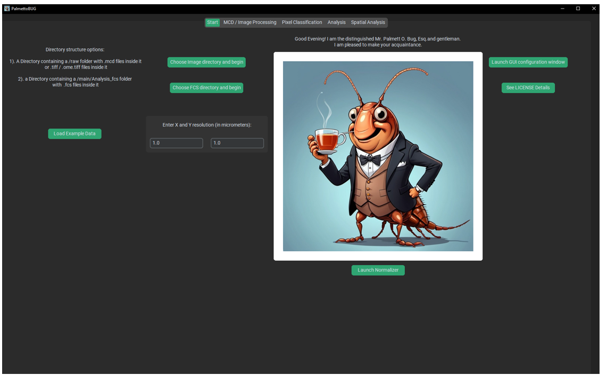
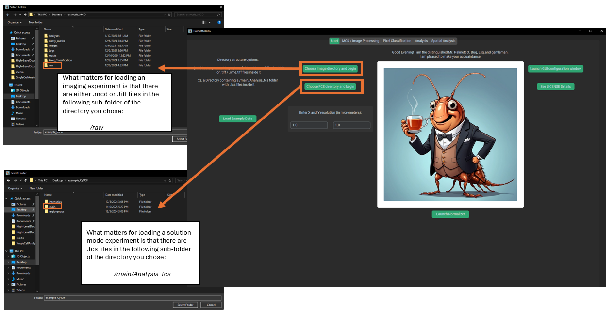

Launching PalmettoBUG
=====================

To launch the GUI, enter the (conda) environment where you installed the
package, then type the following command in the terminal:

>>> palmettobug

Alternatively, you can launch the GUI from a script / jupyter notebook
by the following code (this has the advantage of a MUCH faster restart 
time if you close / re-open the program in the same python session):

>>> import palmettobug as pbug

>>> pbug.run_GUI()

This should launch the PalmettoBUG GUI into the starting tab:

|image1|

*Don’t mind me, I think you’ll find that I’m a very hospitable
cockroach!*

Loading Data into PalmettoBUG
~~~~~~~~~~~~~~~~~~~~~~~~~~~~~

To load data into palmettobug, use one of the two buttons in the center
of the starting screen of the program.

|image2|

For imaging experiments, you must have either .mcd files (the common
export file type from Standard BioTools’ Hyperion images) or .tif /
.tiff files. **MCD and TIFF formats are the only file types supported by
PalmettoBUG!** If you want to analyze images saved in an alternate
format, you must convert them to .tiffs first – in most cases there
should be an opensource tools available to accomplish that conversion,
as .tiffs are an extremely common format for images.

Regardless of whether the experiment is from .mcd files or .tiff files,
you should first check the XY resolution in the field immediately below.
By default, this is 1.0 micrometers / pixel in both X and Y directions,
but if your data has a different resolution you’ll need to change that
BEFORE loading the data. Then, click either of the top two buttons to
launch a file explorer window where you will be able to choose a
directory on your device. The critical expectation PalmettoBUG has for
this directory is that it contains a folder called */raw* that contains
all your .tiff / .mcd files for the experiment (and *only* those files).
This is all that is required to start a PalmettoBUG project.

Clicking the “Choose FCS directory” also launches a file explorer window
but has a very different expectation – in this case, PalmettoBUG expects
to find a */main/Analysis_fcs* sub-subfolder containing .fcs files for
the experiment (and only those files). This means that you need to
create two layers of folders in your desired directory – first a */main*
folder, then an */Analysis_fcs* subfolder (**capitalization
sensitive!)**.

If loading fails, PalmettoBUG will hopefully give you a helpful error
message, to let you know that the data loading failed and maybe provide
a suggestion about why. At the same time, since PalmettoBUG is operating
through the terminal you can always check the terminal for any detailed
error message, in case the program is encountering an error I did not
anticipate!

**Tips, Errors, and expectation –**

Common errors for loading the data include:

1. **Do not mix .mcd and .tiff files in you /raw folder for an imaging
   project!** PalmettoBUG expects one or the other file type, not a
   mixture! If you have a mixture of .mcd’s and .tiff’s for some reason,
   create two separate projects and perform the first Image Processing
   step for each (/raw --> /images/img), then combine the projects by
   copying the output of that first step from one into the other. Also,
   be careful with mixing .tif and .tiff file extensions — PalmettoBUG
   automatically converts the .tif extension (with one f) to .tiff for
   all images it processes, so if you have images with the same name,
   but differing only by .tif / .tiff, *one of them will be overwritten
   by the other when processed by PalmettoBUG*!
2. **Do not mix images with different panels / channels!** PalmettoBUG
   expects all the channels & *the channel order* to be the same across
   the images of a dataset – if this is not true then using the full
   PalmettoBUG pipeline isn’t possible, and you are more likely to
   create errors and inaccurate results than useful data!
3. **Selecting a sub-folder of the directory you actually want.** For
   example, you click the button to load a .tiff experiment. Then you
   navigate to the directory where you made a */raw* folder and placed
   your experiment’s .tiff files into it. However, you click on the
   */raw* folder and then click “Select Folder” to load the directory
   into PalmettoBUG. This will create an error when PalmettoBUG tries to
   load from *project_directory/raw,* instead of *project_directory* –
   it will then look for *project_directory/raw/raw* to look for the
   .tiff files, and not finding it will return an error and refuse to
   load. 

