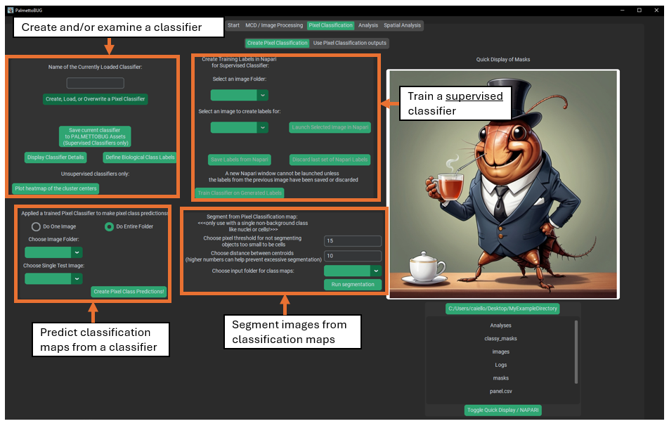
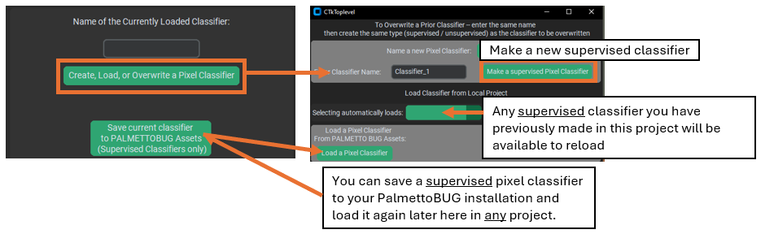
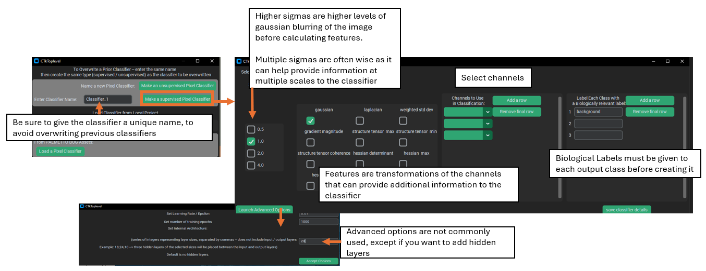
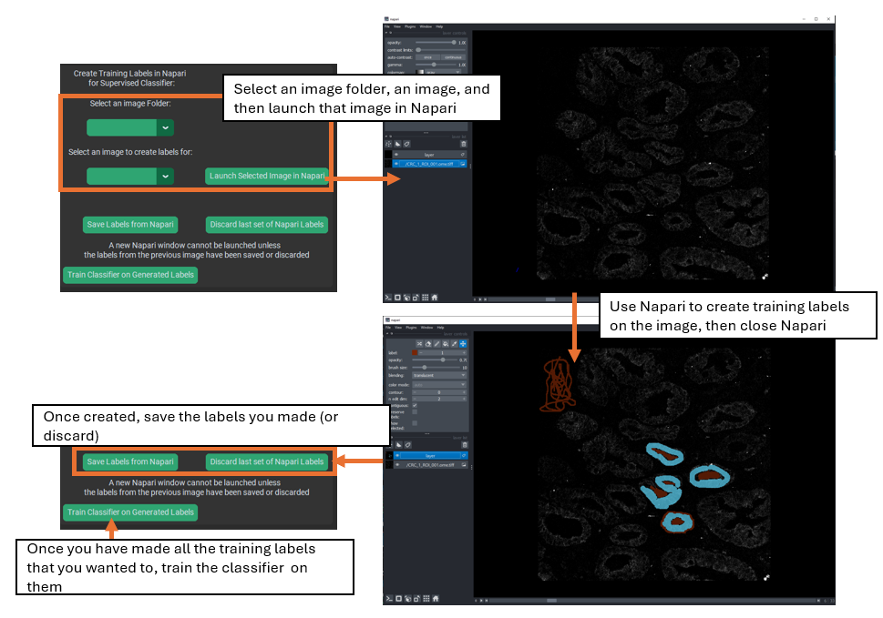
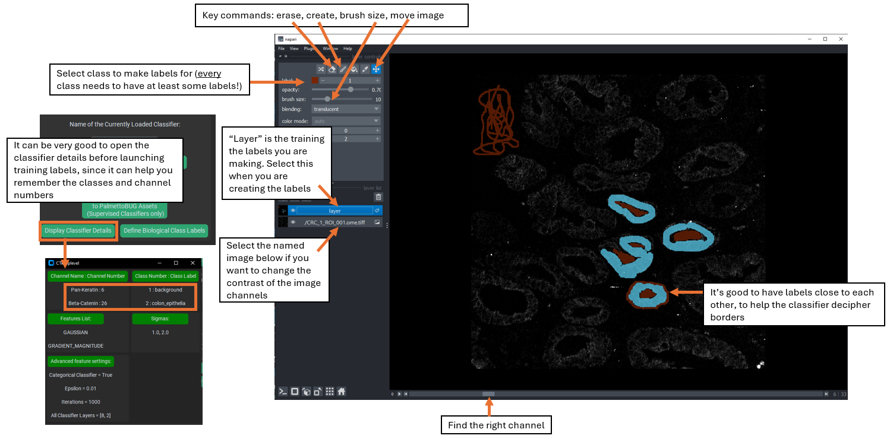
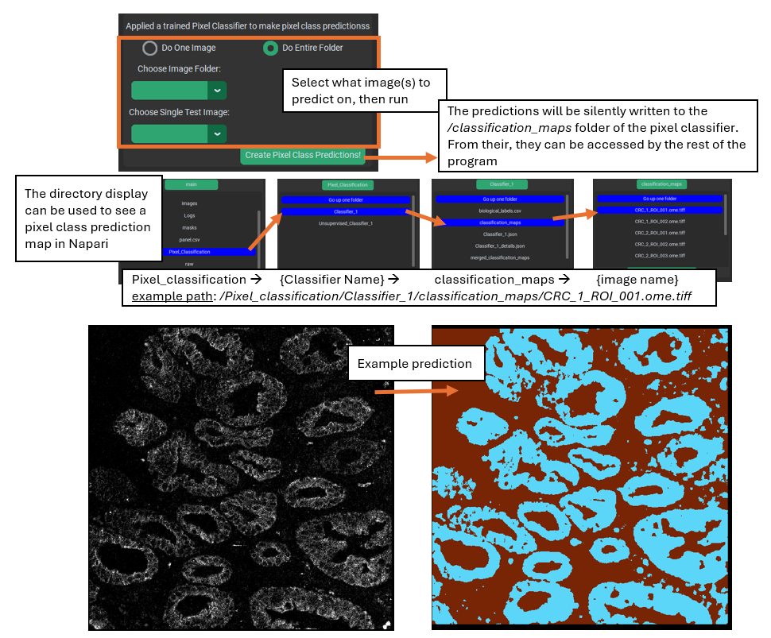
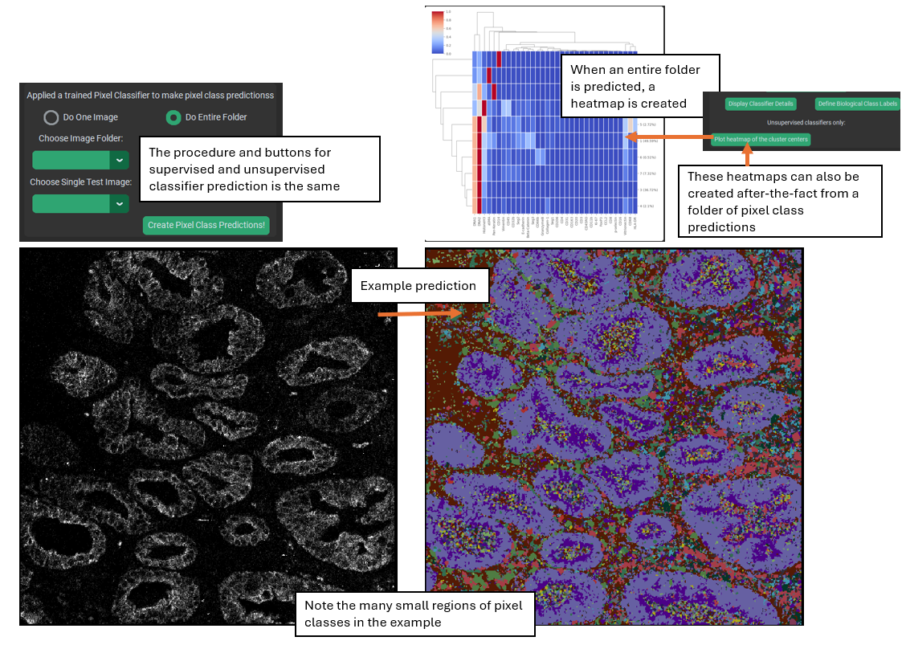
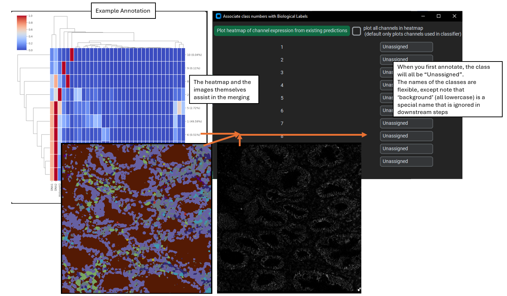
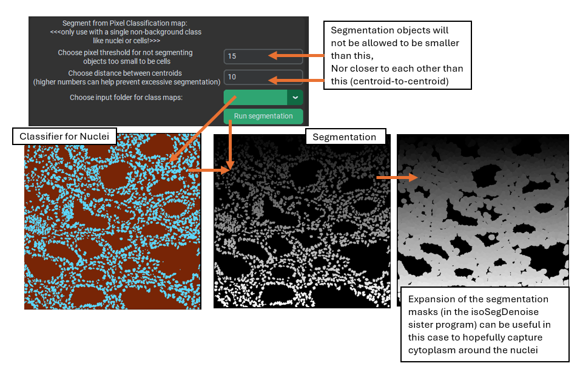

Making a Pixel Classifier
=========================

Go to the bottom of the page for a list of useful links to packages / algorithms used in this module of PalmettoBUG.

Pixel classifiers are made in the first sub-tab of the Pixel Classification tab:

|image1|

What is a Pixel Classifier?
~~~~~~~~~~~~~~~~~~~~~~~~~~~

Pixel classifiers are algorithms that can group the pixels of your
images into classes – these classes can be connected to biologically
relevant groupings and be used to variety of things, including
transforming images, transforming masks derived from those images, and
labeling cells derived from the masks + images.

These classifiers come in two main flavors – supervised and unsupervised
classifiers – which differ in how they are trained and the kind of
outputs they create.

Creating Supervised Classifiers
~~~~~~~~~~~~~~~~~~~~~~~~~~~~~~~

To make any classifier, click on the “create, load, or overwrite” button
in the upper left corner. This will launch a window where you can choose
to either create a pixel classifier (supervised or unsupervised), or
load a classifier. Classifiers can be loaded from the project– any
classifier made in an imaging project will be automatically saved &
available for reload inside that project – or from PalmettoBUG itself.
Supervised classifiers can be saved to PalmettoBUG, making the
classifier then available to *any project* run in that installation of
PalmettoBUG. Only supervised classifiers can be reloaded in such a way
that they can predict new outputs – unsupervised classifiers can be
loaded, but only for the purpose of examining their setup details and
predictions.

|image2|

Once you have chosen to create a new supervised classifier, a new window
will open where you can select the settings for it. |image3|

Key settings for a supervised classifier include:

   1). Sigma(s) – these values control the level(s) of Gaussian blurring
   that is applied to the channels while creating features layers.
   Multiple sigmas can be selected, and this is often recommended as it
   means that the classifier will receive information from multiple
   scales of the data, since higher sigmas (greater blurring) will
   contain more global / non-local information in each pixel, while
   features generated from lower sigmas will contain less blurred / more
   local information.

..

   2). Feature(s) – these are transformation to the image channels which
   can derive more information in addition to the plain intensity
   values. ‘Gaussian’ is included by default as it is analogous to the
   raw intensity of the image, just smoothed and blurred by the chosen
   sigmas. The other features do more radical transformations of the
   data that do not correspond to raw intensity. For example, Hessians
   (especially the Hessian minimum) and the Laplacian use kernels that
   calculate derivatives of the image, and can help identify edges or
   areas of sharp transition in a channels’ intensity – but not the
   intensities themselves. The implementation of these features was
   directly translated from QuPath into python, and you can see QuPath’s
   documentation for more information about the available features and
   why you might use them: `Pixel classification
   — <https://qupath.readthedocs.io/en/stable/docs/tutorials/pixel_classification.html>`__
   `QuPath <https://qupath.readthedocs.io/en/stable/docs/tutorials/pixel_classification.html>`__
   `0.5.1
   documentation <https://qupath.readthedocs.io/en/stable/docs/tutorials/pixel_classification.html>`__.
   One piece of advice from the link above copied here: *“…it can be
   much more effective to use a smaller number of well-chosen features
   rather than throwing them all in to see what comes out the other
   end.”*

..

   3). Channel(s). These are straightforward – they are the channels
   that will be blurred and transformed to generate the sigma / feature
   layers fed into the classifier. Like the features, it is often best
   to stick to a small number of high information channels than to
   include channels with poor signal / limited relevance to the
   classifier’s desired output. Additionally, using fewer channels saves
   a lot of computation: the number of layers calculated & passed into
   the neural network during training and prediction is:

..

   *# of data layers = (# of sigmas) \* (# of features) \* (# of
   channels)*

   This is because for each channel selected, every selected feature
   will be created at every selected sigma, then all those layer of the
   image will be joined together into a large array and fed, pixel by
   pixel, into the neural network for training / prediction.

..

   4). Classes. These are the categories that you want to predict in the
   image. For supervised pixel classifiers, the first class is ALWAYS
   background and gets treated differently than the other classes.
   Typically, it is best to make classifier’s that predict one class at
   a time if the classes are not mutually exclusive – for example, if
   you make a classifier for two different ECM proteins (let’s say
   collagen and vimentin), since the two could be in the same location
   in the image at once it is better to do two different classifiers
   (unless you add a dedicated double positive class). However, if you
   want to find multiple classes are mutually exclusive (such as
   different cell types), then a single classifier may be preferrable.

.. note::

   Images are arrays of numbers, so when the classifier
   makes pixel predictions and saves them as an image, it will be as
   numbers, and not the class labels. Use the classifier details button,
   or look at the *biological_labels.csv* in the pixel classifier’s
   folder to see how the numbers in the pixel classification maps
   correspond to the biological labels that you assigned.

Creating Training Labels in Napari
~~~~~~~~~~~~~~~~~~~~~~~~~~~~~~~~~~

Supervised classifiers are distinct from unsupervised classifiers
because they require more user input than unsupervised classifiers.
Specifically, supervised classifiers require the user to create training
labels in Napari. To do this, first launch an image in Napari, then use
Napari tools to create a label layer, finally close Napari and click the
save labels button in PalmettoBUG. In is other a good idea to open the
details window with the “Display Classifier Details” button before
launching in Napari, as it will contain the information needed to match
channel / label numbers to the desired channels / labels.

.. warning:: 

   While Napari is open in this step (this does not apply
   when Napari is opened by other steps / methods in PalmettoBUG), the PalmettoBUG windows will be
   non-responsive, and if you try to move a PalmettoBUG window the
   entire program may crash! This error is because of how Python handles
   threads. So open any windows you may need (like the classifier
   details) BEFORE launching training labels in Napari, and do not try
   to move these PalmettoBUG windows while Napari is open
   (minimizing/maximizing it should be OK, though)!

|image4|

When you launch an image for training creation, you should see two
image-stacks in the middle-left side of the window, one named “layer” on
top, and the other named after the image that you launched on the
bottom. You will want to use the slider at the bottom of the Napari
screen to select the desired channel, and if you need to change the
thresholds for that image click on the bottom image-stack to gain access
to those controls.

Once you are on your desired channel, be sure that the top image-stack
(“layer”) is selected, to gain access to the labeling tools in the
*upper-left*. You will want to set the label to the number you are going to make training labels for
(remember background = 1, etc.), and then select the paintbrush icon
above the label number to begin labeling the image. Change the brush
size and use the erase icon for fine control of the labeling. Repeat for
every label in the classifier – while not every image has to have labels
for each class, there MUST be some labels for each class available in
the training dataset, and usually every class is present in every image.

|image5|

Then, repeat the Napari launch / labeling process for as many images as
you want. The more images you do, especially if there are diverse fields
of view in the data, then hopefully the more competent the classifier
will be at handling all the diverse images of your project. In general,
it is good to make labels in multiple locations and contexts across the
images, and to have different classes’ labels next to each other at
least some of the time, since labeling the border regions between classes can help the
classifier better distinguish between the classes.

Finally, once you are satisfied with the labelings that you have
created, train the classifier.

.. note::

   The set of images that the classifier will be trained on
   is set by the image folder selected when launching images for training label generation – if you
   change that folder between creating the training labels and training
   the classifier, then the images used in training will be different from the images you used to make the training labels!

Prediction
~~~~~~~~~~

Once a supervised classifier is trained, one or more images can be
predicted. First select a folder – in most cases, this should be the
same folder on which the classifier was trained – i.e., if you trained
your classifier on the images in the denoised image folder, you should
predict with those images, too.

Next, set the prediction to do the entire folder of images or just one
image. If only predicting from one image is selected (which can be
useful to get a quick look at how the classifier appears to be
performing without needing to wait for the entire folder to be run) then
use the drop-down menu for selecting an image. This drop-down is ignored
if you choose to predict the entire folder.

Finally, run the prediction!

|image6|

The predictions are written to the pixel classifier’s
/*classification_maps* sub-folder, where they are accessible by the
rest of the program for downstream steps. However, they are not
automatically displayed after prediction. 

You will want to examine your pixel class predictions to see if they are capturing the classes
that you want accurately, and to do this you should launch the
classification map(s) in Napari. This can be done in the directory
display from inside PalmettoBUG, or you can open Napari in a separate
terminal from PalmettoBUG and navigate to the relevant directories
using your system native file managing app. If you use the directory
display inside PalmettoBUG’s pixel classification tabs, then the
source image will also be loaded into Napari beneath the classification
prediction, allowing you to easily go back and forth between the
pixel class predictions and the original image.

Creating Unsupervised Classifiers
~~~~~~~~~~~~~~~~~~~~~~~~~~~~~~~~~

Unsupervised classifiers are an interesting alternative way to classify
pixels. The implementation is inspired / derived from the Pixie /
ark-analysis / toffy software from the Angelo lab. See this GitHub
repository for details of their package: `angelolab/toffy: Scripts for
interacting with and generating data from the commercial
MIBIScope <https://github.com/angelolab/toffy/tree/main>`__

The specific way these classifiers work is that a subset of all the
pixels in the images are sampled, and a FlowSOM is trained on that
subset, fitting to find a user-defined number of metaclusters in the
data. Then, that subset-trained FlowSOM can be used to predict ALL the pixels
in the images. Before being used for training / prediction, the
intensity values of the pixels are normalized within each channel by
dividing all by the 99.9% quantile, followed by normalizing within each
pixel (designed to follow the normalization steps used in Pixie /
toffy).

Unsupervised classifiers operate with a few key differences from
supervised classifiers:

   1). Training inputs. While supervised classifiers require training
   labels made by the user, unsupervised classifiers train directly on a
   sample of the pixels without needing any similar supervision. This is
   why the two types of classifier are named the way they are.

   2). The output classes of an unsupervised classifier have no
   biologically-relevant label (the classes must be annotated / merged
   after the classifier is run). This is because, without supervision,
   these classifiers merely clump similar looking pixels together
   without any understanding of the biological label that might apply to
   each group – that must be supplied by the user.

   3). Unsupervised classifiers tend to output more classes. While this
   is really under the control of the user, typically unsupervised
   classifiers should create much more classes than a supervised
   classifier – any excess / redundant groups can be annotated and
   merged together later. Overall, unsupervised classifiers use the same
   FlowSOM merging process that is typically utilized to find cell
   types in the Analysis tab of the program.

   4). Some of the hyper-parameters for training are different between
   the types of classifiers. More detail on these in the next section.

   5). Unsupervised classifiers must be used for prediction **when they
   are created**, i.e. they cannot be saved and re-used. They can be
   saved and reloaded for the purposes of viewing their original
   training / setup details, but they cannot be reloaded & run again. If
   you need to duplicate a prior unsupervised classifier, you must use
   the first classifier’s details to create an identical copy, retrain
   it, and then you can proceed with using / predicting from the
   duplicate.

..

   6). The output of unsupervised classifiers tends to be more prone to
   find isolated / discontinuous regions of pixel classes. This is
   likely in part because the higher number of classes predicted and in
   part because there is not a smooth / continuous training set of
   pixels as is typical with the human-provided inputs for supervised
   classifiers. This abundance of small, isolated, or discontinuous
   pixel class regions makes their baseline output harder to use for
   most applications *except classifying cells using a secondary
   FlowSOM.* These problematic regions can also be partly controlled by
   using the “smoothing” option during class prediction.

**Creation**

Creating an Unsupervised classifier starts similarly to creating a
supervised classifier – using the same button in the upper left to
launch the ‘create a classifier’ window. But once in this window, use
the button for creating an unsupervised classifier, which will launch a
new window. Note that whatever name you choose for the classifier will
have “Unsupervised\_” appended to it. As in, if the name you select is
“Classifier_1” (the default), the actual name will be
“Unsupervised_Classifier_1”. This helps keep the two types of classifier
distinct and clearly labeled, and assists PalmettoBUG in identifying
which category a re-loaded classifier is.

|image7|

Once you are in the unsupervised classifier creation window, you will be
presented with a large number of options:

   1). Channels & features. Much like supervised classifiers, you must
   select which channels will be used for training / prediction, as well
   as what features to use for each channel. Unlike supervised
   classifiers, it is possible to have different features for different
   channels. Additionally, the ‘Gaussian’ feature is ALWAYS used for
   every selected channel (which is why it is not visible in the list of
   features).

   2). The image folder for training and number of pixels to sub-sample.
   Unlike supervised classifiers, there does not need to be any training
   labels, but instead a subset of the pixels in the images themselves are used.

.. note::

   Excessively large values for the pixel sub-sampling,
   combined with too many selected features / channels, can cause
   excessive use of computer memory, and if the number is too large, you
   may crash your computer!

   3). Sigma blurring & Quantile normalization. These affect the
   features passed into the classifier. Specifically, the sigma value is
   similar to the sigmas in a supervised classifier – it controls how
   blurred the channel features are – except for unsupervised classifiers only 1 sigma is
   allowed. The %quantile normalization number determines how the data
   are normalized within each channel (default all channels are divided
   by their 0.999 / 99.9% quantile values).

   4). FlowSOM parameters (metacluster number, XY dimensions, training
   iterations). These control how the FlowSOM algorithm is created and
   trained. The most critical of these is the metacluster number, as
   this determines the number of classes in the final predictions. The
   XY dimensions value controls the size of the FlowSOM grid (XY dims
   squared must be greater than the number of metaclusters, but fewer
   than the number of pixels trained on), and greater training
   iterations can improve the stability of the FlowSOM, although it
   takes more time to train.

   5). Random seed. This is needed for reproducibility of both the
   random sampling of pixels in the images as well as the random
   initialization of the FlowSOM grid.

   6). Smoothing. If > 0, then a custom “smoothing” procedure is
   performed immediately after prediction, where any pixel class region
   smaller than the smoothing number (i.e. fewer than that number of
   pixels) will have its values replaced by the statistical mode of the
   values of the surrounding pixels. This mode for a given pixel is
   calculated by looking first at the immediately adjacent pixels to
   calculate the mode (if all of those pixels had been part of an
   isolated region and also dropped, then the mode is calculated for an
   expanded area).

‘Run Training’ from this window completes the creation of the
classifier. This step can take a while to complete, as it will be
performing channel normalizations, pixel subsampling, and FlowSOM
training.

**Prediction**

Prediction is performed in the same way, and using the same GUI buttons,
as for supervised classifiers. You select an image folder (this should
essentially always be the same folder that you trained the classifier
on), choose whether to predict the entire folder of images or just one
image, and then if applicable select the single image to classify.

.. note::
   
   Unlike supervised pixel classifiers, unsupervised
   classifiers cannot make class predictions after being reloaded, you
   must make the predictions the first time you create them – they can
   be reloaded in order to do things like examine their training
   parameters, but not for prediction.

|image8|

When an unsupervised classifier makes a prediction for an entire image
folder, a heatmap is automatically generated at the end (this heatmap can also be
made using the “Make heatmap from previously created predictions” button
in the upper left frame). This heatmap gives an idea of the expression
of the selected channels in each predicted class of the classifier, and
is a key plot for helping to annotate and merge the predicted classes.

**Annotation and merging**

| Unlike supervised classifiers, unsupervised classifiers require an
  annotation and merging step to get to meaningful biological class
  labels. This is accomplished by using the “Define Biological
| Class Labels” button in the upper-left frame, which launches a window
  displaying the class numbers and offering you the ability to provide
  names for each. Choosing the same name for any two of the class
  numbers will merge those classes into one. Typically, the heatmap +
  looking at the pixel class prediction images in Napari can give a good
  idea of what most classes are identifying in the tissue, but any
  un-identifiable class can also be set to “background” so that it will
  be ignored and dropped in the merging. When you launch a pixel
  classification map in Napari from the directory displays in the pixel
  classification tabs, it will automatically open both the pixel
  classification and original image in Napari. The image will be
  underneath the classification layer by default, so you may need to
  adjust the opacity of the class labels to see both the labels and the
  image beneath it better.

|image9|

When you accept the new labels, a new folder
(*merged_classification_maps)* is created in the pixel classifier
directory, where the merged class predictions are written. Specifically,
any class in the original classification maps that was labeled as
”background” is set to 0 in the merged maps, and every group of classes
that share the same label are merged together to a single unique
identifying number. These new numbers are kept track of by the
*biological_label.csv* file.

Segmentation from a classifier
~~~~~~~~~~~~~~~~~~~~~~~~~~~~~~

Why is this section in the document about making a classifier, and not
in the documentation about using a pixel classifier? Because I say so,
that’s why!

In addition to my dictatorial whim, the segmentation controls were
originally placed in the classifier creation tab because limited space
for the widgets in the pixel usage tab – and that still hasn’t been
changed yet.

Segmenting with a classifier is not a procedure you will typically want
to do, except in very particular circumstances. Usually, the generalist
models Cellpose / Deepcell will be sufficient and superior for
segmentation. However, if you want to segment objects that meet at least
two of the following three criteria 1). well separated, 2). generally
circular, 3). generally of a uniform size / distance apart, then
segmentation using a pixel classifier is possible.

To do this, you will want to make a **single-class supervised
classifier** that identifies the objects you want to segment. Once you
have made predictions, you can go to the center-lower frame of widgets
and select the classifier output you want to use, as well as a couple of
parameters that help control segmentation mask size and location.

|image10|

This style of segmentation is quite reasonable for things like nuclear
segmentation (as usually nuclei are generally circular, well separated,
etc.), and nuclear segmentation can often be followed up by expansion of
the masks to approximately capture the cytoplasm around the nuclei.

Links
~~~~~

These are links to some packages / software / manuscripts that can be helpful to understand this page of documentation,
as either code or techniques / ideas from these are used in PalmettoBUG's pixel classifiers.

`QuPath classifiers <https://qupath.readthedocs.io/en/0.5/docs/tutorials/pixel_classification.html>`_

`Pixie / ark-analysis <https://github.com/angelolab/ark-analysis>`_ 

.. |image7| image:: media/MakePxClass/PxMake7.png
   :width: 6.53839in
   :height: 3.15813in

