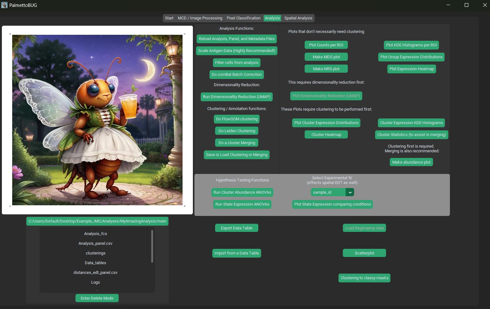
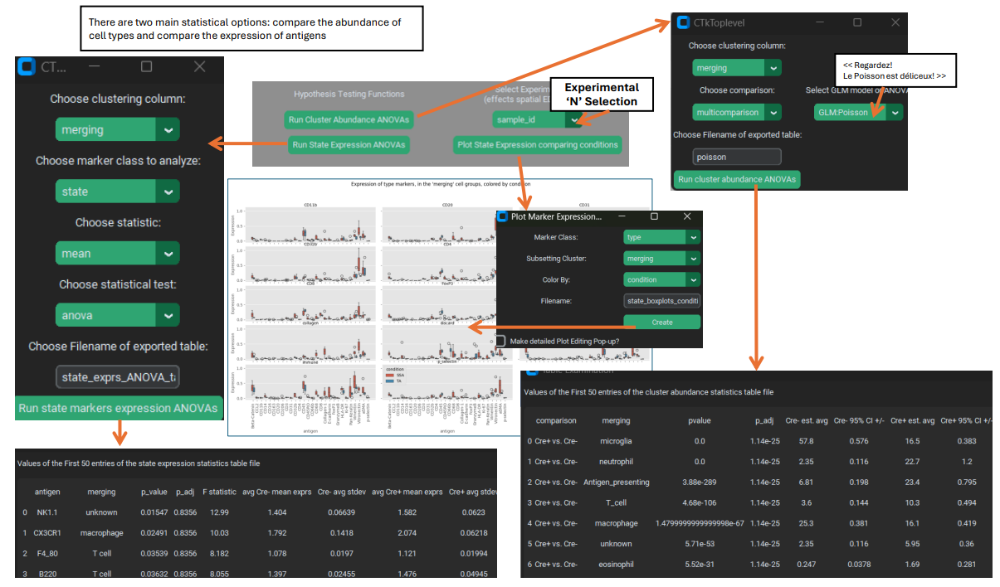

Single-Cell Analysis
====================

Go to the bottom of the page for a list of useful links to packages / algorithms used in this module of PalmettoBUG.

Loading a Single-Cell Analysis from Image Processing
~~~~~~~~~~~~~~~~~~~~~~~~~~~~~~~~~~~~~~~~~~~~~~~~~~~~

To pick where we left of in the image processing documentation, we had
just completed region measurements, and were going to load an analysis:

|image1|

When the “Go to Analysis!” button is clicked, PalmettoBUG will attempt
to load the analysis folder and should launch a new window containing
the Analysis_panel and metadata tables:

|image2|

In these windows, our mission – should we choose to accept it – will be
to categorize the antigens in the dataset and assign key metadata
categories, particularly those pertaining to the groups being compared
in the experiment (treatment vs. control). Specifically, in the first
table (Analysis_panel) there are two editable columns, ‘antigen’, and
‘marker_class’:

   1). ‘antigen’ column: this is here mainly for when loading an
   analysis from FCS files directly, as when loading from
   image processing, these names are usually already correct and don’t
   need editing. This column will contain the
   names of the antigens as displayed in plots, and in the GUI options.
   You want these names to be biologically relevant, and not confusing
   or biologically irrelevant labels like “Nd142Di”. 

..

   2). ‘marker_class’ column: This column can have three values –
   ‘type’, ‘state’, or ‘none’ – these are categories of antigen which
   are important for the single-cell analysis. Antigen’s that you don’t
   want included in most plots, such as segmentation markers like
   DNA1/2, should be set to ‘none’. Antigens that you want to use as
   lineage marker for clustering the cells should be set to ‘type’.
   Finally, antigens that you wish to use as indications of the state of
   a given cell type, or if you want to do statistics on any antigen’s
   expression after clustering, you set to ‘state’. This convention
   is inherited / borrowed from :ref:`CATALYST <Links>`.

For the second (metadata) table, there are again two columns that can be
edited, ‘patient_id’ and ‘condition’, but instead of assigning values to
the antigens in the dataset, we are assigning values to the images /
regions of interest / individual FCS files in the dataset:

   1). ‘patient_id’ column: this column can be used to apply an
   additional grouping to the images / FCS files that is not the
   treatment condition of interest. For example, if a set of images all
   came from the same patient (hence the column’s name), then that could
   be noted here. However, it does not have to be only patient id’s in
   this column – any valid grouping could be considered, including
   things like data collected / batch numbers.

..

   2). ‘condition’ column: This column should contain the treatment vs.
   control, healthy vs disease state, or other comparison of interest in
   the experiment. It is used to group the data when performing certain
   comparisons and statistics.

When you press the “Accept Choices” button, both of these tables are
written as CSV files to the analysis folder (as Analysis_panel.csv and
metadata.csv inside the */main* sub-folder) and you should be
immediately moved into the program’s Analysis tab:

|image3|

.. note:: 

   If you re-load a previously created Analysis, then the
   *Analysis_panel* and *metadata* files will be read from the analysis
   directory, so you do not have to recreate these files every time an
   analysis is reloaded. However, you will still be offered the opportunity
   to examine & edit the files.

Loading a Single-Cell Analysis from the starting screen:
~~~~~~~~~~~~~~~~~~~~~~~~~~~~~~~~~~~~~~~~~~~~~~~~~~~~~~~~

Loading from the starting screen requires that you select the folder
containing the analysis. As covered in the Getting Started / Loading
data documentation page, the key requirement is that within the folder
you select there is a */main/Analysis_fcs* folder containing the FCS
files of your data (and only those FCS files). If you are doing a
solution-mode experiment, then you will need to manually step up these
folders, and then load the directory. For imaging projects in
PalmettoBUG, every sub-folder of */Analyses* (i.e., every individual
analysis made for the imaging project) will be a valid folder for
loading in this way. 

.. note::
   This means that you can load the
   single-cell analysis portion of an imaging project in 2 ways – either
   from the starting page, loading from FCS & selecting the analysis sub-folder, 
   or by loading entire imaging project then entering the analysis from the image 
   processing tab as described above.

|image4|

Once you have selected the correct folder, the loading process is very
similar as above – you will provide the information for the two tables
(*Analysis_panel* and *metadata*) in an identical pop-up window. Again,
if you are reloading the analysis, then the prior *Analysis_panel* and
*metadata* files will be used so you do not have to re-do or edit them (unless
you want to).

Beginning a Single Cell Analysis: initial plots
~~~~~~~~~~~~~~~~~~~~~~~~~~~~~~~~~~~~~~~~~~~~~~~

The analysis tab of PalmettoBUG has its buttons arranged in a number of
major regions:

|image5|

Here I’ll start by showing some preliminary plots you might make –
countplots, MDS plots, plus a heatmap & smoothed histogram of marker
expression in the ROIs:

|image6|

These plots are all mainly concerned with broad patterns in the data,
such as whether your treatment and control groups have identifiably
different expression patterns, as well as the identification of outliers
that may need to be dropped before proceeding with the analysis. For
example, you might consider dropping a sample / ROI (as in, a unique sample_id) 
from the analysis if it has too few cells in it, is distant on
the MDS plot from all the other sample_id’s, and/or has a highly
divergent marker expression pattern on the heatmap/smoothed histogram
plots.

These plots can also give you a indication of whether batch correction
might be needed, such if the samples in your patient_id clusters tightly
together, indicating that whatever grouping you placed in patient_id
(whether batch or patient numbers, or any other confounding variable)
may be influencing the data more than your variable of interest in the
condition column. Do note, however, that these plots are capturing
coarse, global differences between the samples, and don’t yet take into
account cell type abundances and other finer details – so even if your
conditions don’t show any clear separation in their expression profiles
at this step, there might still be differences once you get into cell
clustering and annotation.

There is one more preliminary plot to look into: the NRS plot. Like many
of the function in PalmettoBUG, it was borrowed from the CATALYST
analysis package (https://github.com/HelenaLC/CATALYST). The NRS
(non-redundancy score) plot seeks to identify the antigens in the data
set that contain the most information or are the least redundant with
other antigens in the experiment. It can give an indication if a marker
will be useful clustering the cells or not.

|image7|

.. attention:: 

   The preliminary plots that deal with marker expression (all
   except the countplot) are sensitive to how the data is scaled / batch
   corrected! The expression patterns / NRS scores could change if you
   intend on scaling the data.

.. attention::

   For all plotting windows in PalmettoBUG (and also for
   windows that create data tables), you will typically be prompted for a
   filename. **A default filename is always present as an example, but
   might not match the plot you are actually intending on making!** Be sure
   to rename these as needed, and to avoid overwriting prior plots.

Scaling and Cleaning Data
~~~~~~~~~~~~~~~~~~~~~~~~~

Now that we’ve looked at some of the preliminary plots that can be
generated in PalmettoBUG, we can turn to functions and buttons for
cleaning the data.

|image8|

There are four major actions in this bank of buttons:

   1). Reloading the experiment. This will reset the experiment by
   re-reading from the files on the disk, both the FCS files and the
   metadata/Analysis_panel csv’s. This **undoes any non-permanent data
   transformations**, **including** all three of the other functions
   below (**batch correction, scaling, filtering**) **as well as
   clearing any cell groupings and dimensionality reductions**, while
   also taking in any changes made to the metadata and Analysis_panel
   csv’s. For example, if you realize you made a mistake in labeling a
   the sample’s condition, or if you wanted to change an antigen’s
   marker_class you would want to edit the appropriate csv file, then
   reload the experiment – but then remember to re-do any scaling / data
   filtering, etc. that you needed for the experiment.

..

   2). Filtering the data (or dropping data). This windows allows the
   selection of a grouping in the data – whether that’s sample_id,
   patient_id, condition, or even a cell clustering/annotation – and
   drop one of the unique groups within that grouping out of the data.
   This is commonly done to remove outlier samples or to drop cell types
   that are not of interest (erythrocytes in a solution-mode immune
   dataset for example). 
   
   .. important::
      Data dropped from an analysis in this way can only be restored by reloading the analysis!

   3). Batch correction. ComBat batch correction in PalmettoBUG is
   performed by a thin wrapper on the scanpy function that performs this
   style of batch correction, you can read their documentation for more
   information
   (https://scanpy.readthedocs.io/en/stable/api/generated/scanpy.pp.combat.html).

   .. important::
      If a batch correction step is performed BEFORE any scaling of the data, then it
      can only be un-done by reloading the experiment. However, if a batch correction step 
      is performed after scaling the data, then a second scaling of the data (including unscaling)
      will discard that batch correction. 

..

   4). Scaling. I address scaling last because there is the most to say
   about it. PalmettoBUG lets you perform a few different methods of
   scaling which I will address below. Unlike filtering & batch
   correction, scaling can always be un-done without reloading the experiment,
   as the data before scaling is preserved, allowing easy switching
   between different scaling options. However, still note that when an
   experiment is reloaded the data will automatically be in its unscaled
   state again (just as it will also be un-batch corrected and all
   dropped data will be restored).

**Scaling details**

The scaling option in PalmettoBUG scales data within in channel /
antigen of the data. There are several different ways to scale the data inside PalmettoBUG:

.. Important::
   The data is always **first** transformed using the data = arcsinh(data / 5) transformation commonly used in mass
   cytometry – **the scaling options are all done on the arcsinh transformed data**. 

..

   1). Min-max scaling. This simply scales each channel such that its
   maximum value is 1, and its minimum value is 0, and all the
   intermediate values are between 0 and 1. This method preserves the
   distribution of the original and does not attempt to deal with
   outliers within a channel. For example, if a channel has a few
   extremely bright cells, but mostly cells with dim expression, then
   those bright cells will be close to 1 in value, while all the other
   cells in the data may have values compressed around 0. **The main
   advantage** of this method is that is places all the channels “on the
   same playing field”. As in, every channel will now have value in the
   same range (0-1), unlike the raw data where an antigen could end
   being much brighter than another. For certain methods (such as
   FlowSOM clustering) that use the “distance” between cells in
   expression-space, having some channels with much higher values would
   mean that those channels could dominate the clustering, while dimmer
   channels are ignored.

   2). %quantile scaling. This form of scaling is very similar to
   min-max, with one difference: the channels are not only scaled to
   values between 0-1, but extremely bright cells (those above a
   provided quantile threshold) do not influence the
   distribution of data as much. Specifically, any cells with higher values than
   the value at the provided quantile (often 99.9%, but can be chosen by
   the user) will all be set == 1. This can help deal
   with extremely bright outlier cells in the data, while still provided
   the benefit of min-max scaling by placing all the channels in the
   range 0-1.

   3 & 4). Standard and Robust scaling. These methods seek to center the
   data at 0, with variance of +/- 1. Standard scaling assumes a normal
   distribution (using mean + standard deviation to scale), while the
   robust scaled uses quantile values and is therefore less influenced
   by outliers. However, unlike the previous two scaling methods, these
   do not guarantee data values in a particular range – outlier cells
   are not removed with these methods and can have different maximum
   values in different channels. For more information about these
   scaling options as well as min-max scaling see this helpful page in
   scikit-learn’s documentation:
   `https://scikit-learn.org/1.5/auto_examples/preprocessing/plot_all_scaling.html#sphx-glr-auto-examples-preprocessing-plot-all-scaling-py <https://scikit-learn.org/1.5/auto_examples/preprocessing/plot_all_scaling.html#sphx-glr-auto-examples-preprocessing-plot-all-scaling-py>`__
   (note that quantile transformer in that link is NOT qnorm!).

   5). Quantile Normalization (qnorm). This type of scaling uses a
   rank-based procedure (see wikipedia
   https://en.wikipedia.org/wiki/Quantile_normalization and/or the
   python package being used https://github.com/Maarten-vd-Sande/qnorm)
   to aggressively reshape the data from every channel into both a similar
   distribution and the same range of values at the same time.

**While scaling was covered in this second section of the documentation,
it is frequently performed first, before the preliminary plots are
made.** This is in part because it can affect the outputs of these
preliminary plots, so it is best to do the scaling first. However, the
preliminary plots may still be useful to create with unscaled data as
that could help indicate whether scaling is needed or not.

*Examples of the effects of scaling on the data (using violin plots –
more on those in the clustering plots):*

|image9|

Dimensionality Reduction (PCA, UMAP)
~~~~~~~~~~~~~~~~~~~~~~~~~~~~~~~~~~~~

One frequently important step in analyzing high-dimensional single-cell
data Is visualizing the data using a dimensionality reduction algorithm.
In PalmettoBUG, the two dimensionality reduction algorithms available
are PCA or UMAP. UMAP tends to produce more visually distinct and
interpretable groups and shapes once plotted, while PCA is faster to run
and may be easier to interpret the individual X & Y value, as these are the
top two principal components in the data.

Dimensionality reductions are typically run on a down-sampled subset of
the data, where a set number of cells is sampled from each FCS / ROI in
the dataset (or the entire FCS is used if the down-sample number is
greater than the number of cells in that FCS). This is for a few
reasons, 1). UMAP can be computationally expensive so fewer cells makes
it run faster, 2). This helps prevent excessively imbalanced
representation of the samples in downstream plots and 3). the final dot
plots created after dimensionality reduction can easily get over-crowded
and hard to interpret, so limiting the number of cells can help prevent
that. This down-sampling is also applied when running PCA, even though
PCA is a much faster algorithm. *If you don’t want this down-sampling,
set the down-sampling number to be greater than the number of cells in
the largest FCS / ROI.*

Once the dimensionality reduction is created, it can be plotted either
for the whole dataset or as a set of facetted subsets of the dataset.
For example, you can plot a separate UMAP for each condition in the
dataset, to see if the cells in the same condition form groups.
Dimensionality reductions are also very helpful after clustering (see
next section), as they can help visualize the cell clustering and
indicate how distinct the discovered cell clusters are.

*Example of Dimensionality Reduction plots:*

|image10|

Clustering and Annotation
~~~~~~~~~~~~~~~~~~~~~~~~~

Once you’ve had a first look at the data and did any needed data
cleaning, it is time to try to cluster the cells into groups. In
PalmettoBUG this is mainly done in one of two different unsupervised
clustering algorithms, both being non-deterministic and requiring a
random seed:

   1). FlowSOM clustering. Like the CATALYST workflow that PalmettoBUG
   was originally modeled on, FlowSOM clustering is a major and fast way
   to group cells into clusters. This method work by initializing a
   self-organizing map (SOM) as a grid of points within the data, that
   will then be fit to the shape of the data (see an example of what
   that looks like:
   https://upload.wikimedia.org/wikipedia/commons/6/61/2D_data_training_SOM.gif ). The grid points
   of the SOM are then grouped together into a preset, user-specified
   number of “metaclusters” by an automatic merging process to produce
   the final clustering groups.

..

   2). UMAP + Leiden clustering. In this method, a UMAP embedding is
   performed using all the cells in the dataset (this can be a slow
   process), followed by Leiden clustering on that UMAP embedding. In this
   style of clustering, the final number of groups is determined by the
   algorithm itself, and not preset by the user to a specific number of
   final clusters. This means that getting the hyperparameters of this
   style of clustering can be important to prevent an excessive (or too
   few) set of clusters being generated that is difficult to annotate.

There is one major alternative way to group cells, based on pixel
classification, but that is mainly discussed in the documentation about
pixel classifiers (if you are interested in that method see here: :doc:`UsingPixelClassifier`
). Just note that if a pixel classifier is created in an image-based
project, and cell masks are classified into groups from its output,
those cell classes can be loaded into a single-cell analysis created
from the same cell segmentation masks, and used instead of the primary
pipeline of FlowSOM / Leiden + annotation.

*FlowSOM and Leiden windows in the GUI:*

   |image11|

**Plotting the Clusters**

Once a clustering has been created, the next step is to visualize what
that clustering looks like. There are variety of useful plots for this:
two types of heatmap, violin plots, dimensionality reductions, and
smoothed histograms. The main purpose of these plots are to see if the
clusters generated are reasonable and align with the biological
expectations (identifiable cell lineages) as well as to assist in the
annotation and merging of the clusters in those final biological labels.

*My favorites for annotation are the violin plots, dimensionality
reduction plots, and heatmaps* (Note how the violin plots are HUGE, and
typically require some zooming in to see the details, but that excellent
level of details is why they are so useful):

|image12|

|image13|

In addition to the plots shown above, you can look at statistical
comparisons of marker expressions between the groups as an additional
way to gauge what each cluster is. This is done by comparing the cell
expressions of antigens in each cluster and comparing those with the
expressions in the rest of the dataset (using an ANOVA test to compare
the two for each cluster one-by-one). The statistics from this can then
either be exported in a table on a cluster-by-cluster basis, or used to
create a heatmap of the statistical significance of the difference in
expression between groups. ]

|image14|

.. note::

   Because the clustering algorithms used are
   non-deterministic, it is valuable to test multiple different random
   seeds to see if the clustering achieve is consistent across those seeds,
   or if it is unstable and shifts dramatically between the seeds.

Annotation
~~~~~~~~~~

Once you have examined your cell clustering and are satisfied with their
quality and stability, the next step is to use the plots you have
generated to annotate the clusters into identifiable, biologically
relevant lineages. The output of the unsupervised clustering algorithms
in the prior section is just to assign every cell to a number which by
itself carries no explicit biological meaning. Our job now is to
identify what cell type each clustering number is most likely to be.
Usually, this is accomplished by identifying the cells high in a
particular marker (say CD4) and assigning them to the expected cell
type that expresses that marker (such as CD4+ T cells).

To do this in PalmettoBUG, we use a merging table, where the first
column contains every cluster’s number and the second column contains a
biological name that matches the cluster. If the same biological name is
used for more than one cluster number, then those two clusters are
merged into a single group with the assigned biological label. In fact,
it is preferred when FlowSOM clustering produces somewhat MORE clusters
than there are relevant cell types (so called “overclustering”), as
having more clusters increases the likelihood of identifying rare cell
types, while the merging process during annotation can easily fix the
excess / redundant of clusters. This advantage of overclustering is in
tension with not wanting to over-complicate the annotation process for
the scientist, so often a slight / moderate over-clustering is aimed
for.

*Example merging table:*

|image15|

Note that in the merging table window, there is both an option for
choosing to merge either a metaclustering (from FlowSOM) or a leiden
clustering, since both can be present at once in an experiment.
Additionally, if you have performed any merging earlier in the same
analysis, there is a drop down at the top of the merging window that
allows you to select your prior merging and load it into the window (the
values from the that merging with populate the widgets of the table).
This allows you another way to easily reload a cluster merging, without
needing to re-do everything.

Once an annotation of the cells has been made, it is possible to make
all the same plots as above (for cell clusterings), just now using the
merged & annotated labels\ :

|image16|

Additionally, the abundance plot is available – while this plot type
could be used for a metaclustering / leiden, because they are dedicated
to visualizing the differing quantities of cell groupings across the
conditions of the experiment, they are usually saved for the final
merging:

|image17|

**Saving and reloading annotations**

To help save time, and allow you not have to redo clustering every time
you re-enter or reload an experiment, PalmettoBUG allows you to save a
cell clustering or annotation.

|image18|

When saving, if a cell grouping is available to save, then it will
appear in the drop down as an option, and similarly when loading, if a
saved clustering is available it will show up in the drop down menu
(this works by looking in the expected */main/clusterings* folder in the
analysis directory for any saves). When a grouping is saved, it is saved
in a csv file using the type of grouping (metaclustering, leiden,
merging, classification) + the identifier in the text field below the
drop-down menu in order to name the file. This means that if you want to
save two different metaclusterings, for example, you will need to save
with two different identifiers (often, this would be the random seeds of
the FlowSOMs).

When reloading, note that the data ideally should be the same state (the
same batch correction, scaling, etc.) as when the grouping being loaded
was originally saved. If not, you will likely get an error or warning
message, depending on if the difference was enough to block the reload.
For example, if you dropped a sample, ran the FlowSOM clustering, and
then saved that (meta)clustering, if you reload the analysis you MUST
drop the sample again to reload the clustering – because the number of
clustering labels and the number of cells would then not align and the
program will refuse to load it.

The same window that handles clustering save / load also handles the
loading of cell type annotations derived from a pixel classifier – if
you are interested in that capacity, go to the pixel classification
documentation pages! I’ll only mention here that if a pixel-derived
classification does exist, it should be visible in the drop down, and
that if you do use this then it will be referred to as “classification” by the 
Analysis tab's widgets, and can be saved, used to make plots, statistics, etc. the 
same as any other cell grouping.

Statistics
~~~~~~~~~~

In PalmettoBUG, there are two major types of statistical test available:
comparison of cell type abundance between conditions, and comparison of
antigen expression within cell types between conditions. These two major
types of test are inherited from the CATALYST / diffcyt workflow on
which PalmettoBUG was modeled / derived. However, due to the differences
in statistical tests easily available in Python vs R, PalmettoBUG
implementation tends to rely on simpler tests (for example, PalmettoBUG
only offers ANOVA or Kruskal-Wallis tests for expression comparisons,
and does not offer GLMM models for either comparison type).

For abundance tests, PalmettoBUG can do

   1). ANOVA or a Gaussian GLM on the portion of cell types in each
   sample. As in, cell type abundances are converted to fractions of the
   total in each sample, and those fractions are used to perform the
   test. This is a very simple type of test, but is likely not as good
   as option 2:

..

   2). Poisson or Negative Binomial Generalized Linear models (GLMs) on
   the count data from each sample. Since the abundance of cell types in
   each sample / image can be thought of as counting process, using
   these tests should better model the data.

For testing the expression of antigens (usually ‘state’ markers) within
cell types, PalmettoBUG can only do ANOVA or Kruskal-Wallis tests, using
either the mean or median expression value for each cell type within
each sample / image. Notice that this test is not performed using the
cells as the sample population, but instead the aggregate statistic
(mean / median) of each sample / image in the dataset.

.. warning::
   
   Variability or batch effects between different runs of the
   imaging mass cytometer or in the stability of FFPE tissue can make
   the comparison of expression unreliable, unless you have a plan for
   controlling these effects!

.. note::
   
   For both types of statistical test, PalmettoBUG does all
   possible comparisons at once, and automatically calculates a False
   Discovery Rate (FDR)-corrected p-value to account for the
   multi-comparison using the Benjamini-Hochberg test (as implemented in
   scipy). Both the unadjusted and adjusted p-values are displayed in the
   final exported stats tables:

|image19|

These statistics tables (like most other tables generated by this
portion of the program) are saved in a *main/Data_tables* folder of the
analysis directory. **Be careful with the filenames and the default
values in the GUI – change them to fit your needs!**

Export / Reload of Data
~~~~~~~~~~~~~~~~~~~~~~~

The majority of the data in a PalmettoBUG analysis is just a large excel
table at heart, with a couple smaller tables of metadata (specifically,
the data is *mostly* stored within an anndata object, see:
https://anndata.readthedocs.io/en/stable/ if you want to know more of
the inner workings of the python code). The data & critical metadata can
be exported as a single large CSV file by PalmettoBUG, allowing easier
access by another software (such as excel, Prism, or other code-based
pipeline), in case you want to do some of your data analysis outside
PalmettoBUG.

|image20|

Additionally, a CSV exported in this way can be reloaded back into
PalmettoBUG, as an easy way to transfer an analysis between two
different installations of the program, although there are a few
important things to note about this export if you intend on reloading it
into PalmettoBUG:

   1). While *most* of the information can be transferred into the CSV
   file, currently **no spatial information** is. This means that if you
   re-load the CSV of an imaging experiment back into PalmettoBUG, you
   will be able to do the single-cell analysis steps & plotting as show
   in this document, but you will not be able to do spatial analysis.

..

   2). The data will be saved exactly as it is – meaning that if you
   scaled or batch corrected the data, etc. those changes will be
   propagated into the exported file. **If you want the raw, unaltered
   data** (except arcsinh transformation, which is always done), **load
   / reload the analysis immediately before exporting!**

   3). If your intention is to ONLY reload back into PalmettoBUG, then
   you will want to transfer the marker_class information ('type' / 'state' / 'none') as well. There
   is a check box for this purpose in the exportation window which writes 
   the marker_class information to the final row of the exported CSV
   However, you will NOT want to do this if you intend on loading the CSV into
   any other program (it will probably cause errors unless you manually
   remove that final row of marker_class information).

You can also choose to only export a subset of the data or choose to
export aggregate statistics from data. For example, you could choose to
only export the counts of celltypes in samples 1-5. These abilities are
provided so that you can easily drop unwanted data when exporting, and
allow you to prepare the data so that it is more straightforward to
analyze by another software. Of course, if you do export an aggregate
statistic instead of the raw data, do not try to load the CSV back into
PalmettoBUG!

Finally, you also can export the (X, Y) coordinates from the
dimensionality reductions (UMAP and PCA embeddings), so that it is
possible to plot the UMAP in another software. Because of the
down-sampling for UMAP / PCA, the export will also include the cell
number from the original data for each point – allowing the
dimensionality reduction to be merged with the original data before
plotting.

Miscellaneous: Loading Regionprops & more
~~~~~~~~~~~~~~~~~~~~~~~~~~~~~~~~~~~~~~~~~

**Load Regionprops**

One of the final PalmettoBUG capacities worth mentioning is the ability to load
the region properties of the cell masks into the analysis as if they were antigens.

This button depends on the analysis having been derived from an imaging
experiment. It will load the shape-based properties of the cell mask
like **area, perimeter, etc.** into the analysis as if these properties were
antigens / metal channels. This allows you to set these properties to a
marker_class and then plot or cluster the data using them (+ any other
antigens of the same marker_class), just as you would with any other
antigen.

Region properties tend to have very different distributions / scales
than normal antigens and the types of regionprops offered by the
PalmettoBUG GUI are limited, so this is not anticipated to be an option
that is commonly used.

|image21|

**Scatterplots**

PalmettoBUG has a rudimentary scatterplot option to help visualize the distribution of 
one channel's expression per cell vs. another channel's expression. Note that no gating is possible
in PalmettoBUG for these plots, they are only available to aid in visualizing the data.

**Clustering-to-ClassyMasks**

If you want to directly visualize the spatial characteristics of a clustering (FlowSOM metaclustering, Leiden, or merging) that you made in 
the Analysis tab of the program -- especially in Napari -- you can convert the clustering labels to "classy masks".

Classy masks are created by assigning each unique clustering value to a unique integer value, then creating a copy of the original cell segmentation masks 
where each cell mask takes on its unique clustering value. These converted masks are then written to the /classy_masks folder in the higher-level project directory 
(outside the analysis), along with a table of each cell's clustering label & integer value. This is analogous to the classy masks derived from 
pixel classifiers (see :doc:`UsingPixelClassifier`).
Classy masks are different than regular segmentation masks because each cell in an image not longer has a unique value -- so cells are no longer uniquely identified --
but instead can share a value if they belong to the same cluster. 

These can be very useful to open in Napari, and overlay with the original image -- allowing you to scroll through the channels of the original image with the 
classy masks on top to see if cell clustering labels visually make sense with the actual expression of the channels.

Naturally, this option only works for imaging projects -- not solution-mode / FCS-only projects.

.. _Links:
Links
~~~~~

These are links to some packages / software / manuscripts that can be helpful to understand this page of documentation,
as either code or the techniques / ideas from these are used in PalmettoBUG's single-cell analysis module.

`CATALYST <https://github.com/HelenaLC/CATALYST/>`_

`CATALYST workflow <https://www.bioconductor.org/packages/release/workflows/vignettes/cytofWorkflow/inst/doc/cytofWorkflow.html>`_

`anndata <https://github.com/scverse/anndata>`_

`scanpy <https://github.com/scverse/scanpy>`_ 

`FlowSOM <https://github.com/saeyslab/FlowSOM_Python>`_ 

.. |image1| image:: media/SingleCellAnalysis/ImageProcessing12.png
   :width: 5.72982in
   :height: 3.08774in
.. |image2| image:: media/SingleCellAnalysis/SCAnalysis1.png
   :width: 4.93942in
   :height: 3.44809in
.. |image4| image:: media/SingleCellAnalysis/SCAnalysis2.png
   :width: 5.8578in
   :height: 3.42096in

.. |image5| image:: media/SingleCellAnalysis/SCAnalysis4.png
   :width: 6.17833in
   :height: 4.10766in
.. |image6| image:: media/SingleCellAnalysis/SCAnalysis5.png
   :width: 6.46445in
   :height: 3.52506in
.. |image7| image:: media/SingleCellAnalysis/SCAnalysis6.png
   :width: 5.16711in
   :height: 4.02535in
.. |image8| image:: media/SingleCellAnalysis/SCAnalysis7.png
   :width: 6.5in
   :height: 2.88819in
.. |image9| image:: media/SingleCellAnalysis/SCAnalysis8.png
   :width: 6.5in
   :height: 3.00556in
.. |image10| image:: media/SingleCellAnalysis/SCAnalysis9.png
   :width: 6.5in
   :height: 3.63889in
.. |image11| image:: media/SingleCellAnalysis/SCAnalysis10.png
   :width: 5.91061in
   :height: 3.19463in
.. |image12| image:: media/SingleCellAnalysis/SCAnalysis11.png
   :width: 6.60215in
   :height: 4.81759in
.. |image13| image:: media/SingleCellAnalysis/SCAnalysis12.png
   :width: 6.43071in
   :height: 3.98653in
.. |image14| image:: media/SingleCellAnalysis/SCAnalysis13.png
   :width: 6.5in
   :height: 3.83958in
.. |image15| image:: media/SingleCellAnalysis/SCAnalysis14.png
   :width: 6.5in
   :height: 3.4in
.. |image16| image:: media/SingleCellAnalysis/SCAnalysis15.png
   :width: 6.28597in
   :height: 3.54272in
.. |image17| image:: media/SingleCellAnalysis/SCAnalysis16.png
   :width: 6.5in
   :height: 3.63056in
.. |image18| image:: media/SingleCellAnalysis/SCAnalysis17.png
   :width: 6.5in
   :height: 2.6in

.. |image20| image:: media/SingleCellAnalysis/SCAnalysis19.png
   :width: 6.5in
   :height: 4.41806in
.. |image21| image:: media/SingleCellAnalysis/SCAnalysis20.png
   :width: 7.2in
   :height: 4.0in
