Spatial Analysis
================

Go to the bottom of the page for a list of useful links to packages / algorithms used in this module of PalmettoBUG.

Getting Started
~~~~~~~~~~~~~~~

The initial steps towards Spatial Analysis are doing the image
processing steps for your experiment (masking, region measurements,
etc.), followed by transitioning to the single-cell analysis for that
experiment and doing your clustering / annotation of the cells. If you
have not done these steps, follow the documentation for those first!

What happens when you load the analysis for an imaging project is that
the centroid data from the regionprops csv files in automatically
loaded, ready for spatial analysis.

.. important::
   PalmettoBUG spatial functions (except the EDT / pixel
   classifier option) use the **centroids** of the cells to calculate
   distances between cells, **not the edges of the cells**.

Once you have loaded the analysis from the imaging project & clustered
and annotated your cells, you click to the Spatial tab:

|image1|

There 3-4 major categories of spatial analysis, Spatial Neighbors,
Neighborhoods, SpaceANOVA, and Distance(EDT)-from-pixel class.

Plotting Cells
~~~~~~~~~~~~~~

The simplest style of spatial plot is the cell map. These just provide a
view of the cells as they are positioned in the ROI / image, with the
cells colored by their cell type / cell grouping:

|image2|

There are two style of cell map, “masks” and “points” as shown above.

Spatial Neighbor analysis. 
~~~~~~~~~~~~~~~~~~~~~~~~~~~

This section is all thin wrappers on squidpy
(https://squidpy.readthedocs.io/en/stable/) functions, which use either
a fixed radius or a fixed number of nearest neighbors for each cell to
make a grid of spatial connections between the neighboring cells of each
image. *The creation of this grid is also necessary before doing
neighborhood analysis.*

|image3|

Then, plots can be made of the raw number of interactions between cell
types (“interaction matrix”) or the enrichment over random (by
permutation test) of interactions between cell types, or plots of the
centrality of the different cell types. There are three different types
of centrality statistic that can be plotted (see squidpy documentation
for details), but here I just show one type, closeness centrality:

|image4|

Neighborhood Analysis. 
~~~~~~~~~~~~~~~~~~~~~~~

*This section requires the grid of connected neighboring cells from
Spatial Neighborhood analysis section to have been made.* Using the
previously identified connections between neighboring cells, this type
of analysis finds the proportion of each cell type among the neighbors
of each individual cell, then uses a FlowSOM or Leiden clustering to
group the cells based on the proportions of its neighboring cell types.
These groups, or “cellular neighborhoods” (CNs), can be used to
represent distinct types of environments / niches in the tissue. In
PalmettoBUG, plots of the proportion of cel types in each CN can be made
to help annotate what these CNs might be in the tissue (for example,
“T-cell enriched tumor”). **Once a CN grouping has been created, it can
be used in the same way as the non-spatial clusterings**
(“metaclustering”, “merging”, “ leiden”, “classification”) **are in the
single-cell analysis tab** (once CNs are created, go back to the
analysis tab and see that ‘CN’ will become available as a way of
grouping/faceting plots). This includes creating plots like violin plots
and abundance plots, as well as any other plots that use a cell
groupings like these.

Cellular Neighborhoods:

|image5|

SpaceANOVA
~~~~~~~~~~

The section of spatial analysis options, SpaceANOVA, is a python
translation of an R package with the same name
(https://github.com/sealx017/SpaceANOVA). Specifically, what this allows
you to do is calculate Ripley’s statistics (K / L) as well as the
pair-correlation function (referred to as ‘g’ in the program) between
all cell types in the data set.

*A Graphical Explanation of Ripley’s statistics:*

|image6|

|image7|

The key takeaways from the graphical example above is that the Ripley’s
statistics provide a way to see if cell types are associating with each
other more or less than would be expected by chance, creating a function
with values at every radius of interest. In PalmettoBUG, these types of
graphs can be calculated for every cell type --> cell type pair, with a
few parameters, such as the range of radii, selected by the user:

.. note::
   The comparison celltype A --> celltype B usually produces a slightly different
   statistic than celltype B --> celltype A, although typically these two statistics
   are very similar. 

|image8|

Some parameters of particular note are:

   1). The permutation correction. This makes the SpaceANOVA analysis
   slower, but is almost always recommended. What this does is calculate
   the average Ripley’s K for a cell type over the
   selected number of random permutations where the cell type labels
   are randomly shuffled within each image. This permutation K is then
   subtracted from the K calculated from the actual data (unshuffled),
   which helps correct the final output for any peculiarities of the data itself –
   such as inhomogeneities / holes in the tissue that could shift the
   value of the K function even when the cell types are randomly distributed in
   the tissue.

   2). The random seed. This is used for the shuffling of data in the
   permutation correction, but also for a few other steps in the
   SpaceANOVA pipeline, including the later functional ANOVA and
   plotting steps (they use bootstrapping that requires a seed). So this
   seed is ALWAYS relevant, even if you do not use permutation
   correction.

   3). Cell Threshold. If an image has very few of a given cell type, it
   may not give a reliable result for the Ripley’s statistics. The
   threshold parameter lets you select the minimum number of cells of a
   particular cell type needed within an image for PalmettoBUG to
   proceed with calculating statistics for that cell type in that image.

   .. note::
      It can happen that a given cell type does not meet the
      threshold in ANY image of a given condition. In this case, PalmettoBUG will not
      use comparisons for that cell type / condition in the subsequent
      functional ANOVA test. However, even if a condition fails to meet
      the per image threshold like this, PalmettoBUG will still be able to plot the
      other conditions in the dataset that do still have valid statistics /
      images that met the threshold. *PalmettoBUG will also print a warning
      to the terminal any time an image or an entire condition fails to
      meet the threshold – this often ends up being a lot of messages!*

   4). Radii min, max, step. These parameters set the range of radius
   values to calculate over. As in for the defaults (min = 0, max = 100,
   step = 1), Ripley’s statistics are calculated at around 100 points
   (0, 1, 2, 3, … 98, 99, 100). The statistics at zero, of course always
   = 0.

.. note:: 

   The first few radii after zero essentially never find any
   adjacent cells because the distance between cells is calculated from
   centroid-to-centroid (not from cell edge to cell edge). In my
   experience, these first few radii tend to create a sharp spike in the
   g statistic that is presumably unreliable – so I expect setting the
   minimum radius somewhere in the range of 10-20 is reasonable in most
   cases, although the specific number depends on the proximity and size
   of your cell masks. If you see similar sharp changes in the g
   statistic over the first few radii for all your comparisons, that
   might indicate you may want to increase the minimum radius.

Once the SpaceANOVA calculation for the Ripley’s statistics has been
performed, the buttons for plotting and statistics become available. For
plotting the statistics themselves, PalmettoBUG lets you select a
particular cell type –-> cell type comparison as well as the Ripley’s stat
you are interested in, and also whether you like to add “F-values” to
the plot. 

These F-values are the F-statistics from ANOVA tests performed
at every individual radius in the calculations, comparing the statistic
of choice between the conditions in the dataset. This requires that
there are 2+ available conditions for that cell type comparison
(remember a condition could fail to meet the cell number threshold in
all its images for a particular cell type). The F-values can be very
useful for identifying at what distance the difference in cell type
clustering between treatment vs. control is most statistically
significant, but should not be used on its own as there is no correction
for multi-comparison – instead the functional ANOVA should be used to
determine if two conditions differ overall.

|image9|

For statistically comparing the difference between how cell types
cluster in conditions, SpaceANOVA uses functional ANOVA (fANOVA). This
performs an ANOVA test on the entire Ripley’s function curve between the
different conditions (using scikit-fda’s implementation of fANOVA:
https://fda.readthedocs.io/en/stable/modules/inference/autosummary/skfda.inference.anova.oneway_anova.html).
This approach means that the entire range of distance radii is tested at
once for significance, and not a single cherry-picked distance. However,
if the functional ANOVA finds a significant difference between the
conditions over the entire range and you are interested in knowing
which particular distance(s) the different between is most significant,
then the F-value plots can be used (as discussed in the paragraph above).

PalmettoBUG automatically calculates the fANOVA values when you click
the “SpaceANOVA statistics” button. You will then be able to either
export the p-values from the fANOVA tests as a table, or plot them in a
heatmap:

|image10|

These p-value statistics can be calculated from K, l, or g. Note that it
is not uncommon for most adjusted p-values to be at or near 1.0 (this is
why I display the unadjusted p-values in the figure above). The raw
p-values are adjusted by the Benjamini-Hochberg correction for False
Discovery, to take into account the large number of comparison being
made (one for each cell-type celltype pair).

.. important::

   As currently set up, PalmettoBUG automatically uses all the derived p-values in the 
   FDR adjustment process. However, it may not be wise to treat reverse-order comparisons 
   (such as T-cell --> B-cell vs. B-cell --> T-cell) as independent tests needing correction for multi-comparison.
   Comparisons like these are NOT 100 % IDENTICAL, however they are understandably 
   highly related to each other -- I was not sure how to handle the FDR correction for these, so for now 
   the default behaviour is just to correct them all as if they were independent hypothesis tests. If
   this is not preferred (it is likely too harsh in correcting for multicomparisons?), it should be fairly straightforward 
   to take the matrix of unadjusted p-values calculated by PalmettoBUG and do a different p-value 
   adjustment in another software.

Distance-to-Pixel Class
~~~~~~~~~~~~~~~~~~~~~~~

Sometimes the spatial question you want to ask does not only cells, but
also non-cellular structures. In PalmettoBUG, the best way to identify
non-cellular structures is with a (typically supervised) pixel
classifier. PalmettoBUG allows you to take the output
of a classifier and calculate the distance between cells masks and the
pixel class. Examples of what could theoretically be done include cell
distance from beta-amyloid plaques, or distance from fibrotic regions,
etc.

To do this, a pixel classifier identifying the plaque / tissue / regions
of interest on the slide must be created. **How to create a pixel
classifier & predict classification maps is not covered here!** See the
documentation for pixel classifiers to learn about those steps.

Then, a distance calculation can be performed using a Euclidean Distance
Transform (EDT) on the pixel classes of interest, which is why this
module is frequently referred to with the label EDT.

*Graphical Summary of the EDT method:*

|image11|

*EDT calculation window:*

|image12|

The key parameters for the EDT calculation are as follows:

   1&2). The filepath to a pixel classifier directory & type of
   prediction sub-folder. Critically, within the provide folder there
   must be two things within the classifier directory: a). A biological
   label CSV to identify its classes (this is automatic for supervised
   classifiers, since you must assign the labels before creating them),
   and b). a sub-folder with predicted pixel classification maps for
   *every* image in the dataset. Because PalmettoBUG pixel classifier’s
   can have two different kind of prediction maps (the original
   classifier predictions in a */classification_maps* subfolder or
   merged predictions in a */merged_classification_maps*
   subfolder), this must be specified in the drop down immediately below
   classifier selection. 
   
   .. note::
   
      If you use the /*merged…maps* folder for a supervised classifier, the background class will not
      have an EDT calculated. This is often preferable, unless the "background" class has some biological 
      meaning of its own!

..

   3). Marker_class. This determines how the newly added EDT channel(s)
   are treated once merged into the analysis – will they be “type”,
   “state”, “none”, or a new marker_class “spatial_edt”? The default is
   the new “spatial_edt” class, because it is assumed that you will want
   to treat the EDT channels differently than the regular channels and
   because “spatial_edt” channels are treated specially in the GUI **–
   the dedicated EDT plotting buttons in the spatial tab only
   works for “spatial_edt” marker_class**. However, if you wanted to
   cluster your cells based on EDT values, you would want to set them to
   “type”, and then return to the analysis tab and run a FlowSOM /
   Leiden clustering.

   4). Smoothing threshold. Isolated regions of the pixel class of
   interest in the pixel classification maps that are smaller than the
   smoothing threshold will be excluded. This is included because pixel
   classifiers (especially unsupervised ones) can find very small regions of a
   given class, which might be biologically irrelevant. Further, a
   Euclidean distance transform is very sensitive to the presence of
   even a single pixel of the class of interest, as a single pixel of the class of interest
   can create a large circular region of lower EDT values around it.

..

   5). Statistic. This determines what aggreagate statistic is used to 
   summarize the EDT value inside a cell mask. Much like when reading the region properties during
   the main pipeline of the program, the statistic when reading the EDT
   values from the mask region does not have to the be the mean value
   (even though this is typical) of the pixels inside the mask. Mean,
   median, and minimum are the options provided by PalmettoBUG, with
   minimum being a particular interest in this case as that would
   represent the minimum distance between a cell and the pixel class of
   interest.

   6). Normalization. Images with more pixels in the class-of-interest
   will naturally tend to have lower EDT values across the image (and
   vice-versa) -- although this is also affected by the distribution of the class 
   within thimage. Having a generally lower EDT value in an image will in turn 
   affect the EDT values of the cells. Typically, though, you are not interested
   in only if there is more the pixel class in an image, but whether particular cell
   types are more or less associated with the pixel class than you would expect by chance.
   Checking the normalization option means that the EDT value for every
   cell will be divided by the average EDT value across the entire image
   that cell came from, which is intended to help control this effect.
   Note that normalization only works if the aggregrate statistic is median or mean, not minimum.

.. Attention::
   When calculating the EDT values\ **, PalmettoBUG will
   calculate EDT values using every class in the selected
   classifier**, assigning them all the same marker_class. Typically, it is
   best to make dedicated supervised classifier for each object of
   interest, so this should not be an issue, although for some applications
   (like when identifying mutually exclusive regions, like tissue layers)
   you may want to have multiple classes in one pixel classifier.

**EDT plots and statistics**

Once the EDT values have been added to the analysis, there are a few
possibilities about how you can use them.

If you added them as “spatial_edt” marker class, then they will be
accessible to the handful of dedicated EDT plotting functions in the
spatial tab – which will be focus of this section. However, they are always
accessible to ANY function that can use the selected marker_class, *including in the analysis tab!* 
This means any plot, clustering, dimensionality reduction, etc. covered in the
Single-Cell Analysis documentation could take an EDT channel as an
input. However, if you do choose 'type' as a marker_class
(for example), then your EDT calculations will be plotted along with all the other channels set to 
'type', which is usually more confusing than useful.

*The outputs of the dedicated EDT functions are shown below:*

|image13|

Key points include 1). the heatmap requires at least two markers with
the marker_class “spatial_edt” to run. 2). The statistics function in
the spatial tab is just a convenience wrapper on the “state expression
ANOVA” from the analysis tab – it is the same function, just only for
“spatial_edt” channels. 3). Whenever you are looking at EDT values, it
critical to remember that higher numbers mean greater distance from the
target pixel class, and lower number means greater proximity to the
class.

**Save / Reload EDT:**

Whenever you run an EDT calculation, the results of the calculation are
saved in a CSV file in the analysis, *under the name of the classifier
folder that you used!* If for any reason you need to reload an EDT
calculation or change the marker_class of EDT channels in a classifier,
such as if you exit / re-enter PalmettoBUG — then you can directly load
the EDT from the CSV, setting the marker_class when you do so, instead
of needing to redo the calculation.

Links
~~~~~

These are links to some packages / software / manuscripts that can be helpful to understand this page of documentation,
as either code or techniques / ideas from these are used in PalmettoBUG's spatial module.

`squidpy <https://github.com/scverse/squidpy>`_

`SpaceANOVA <https://github.com/sealx017/SpaceANOVA>`_ 

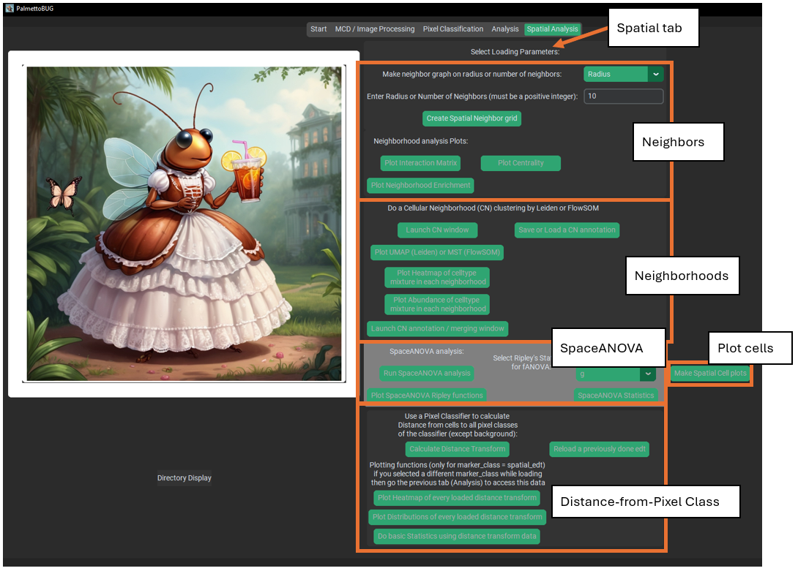
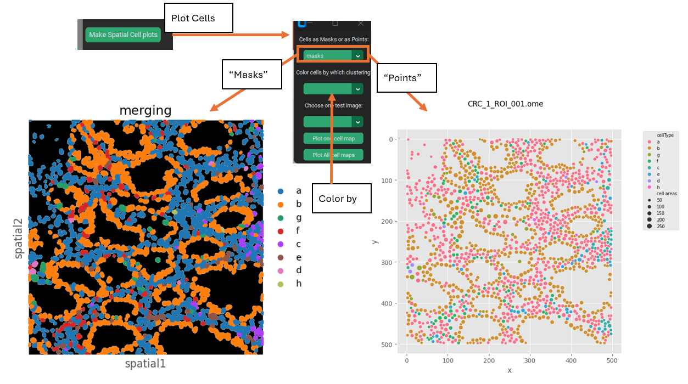
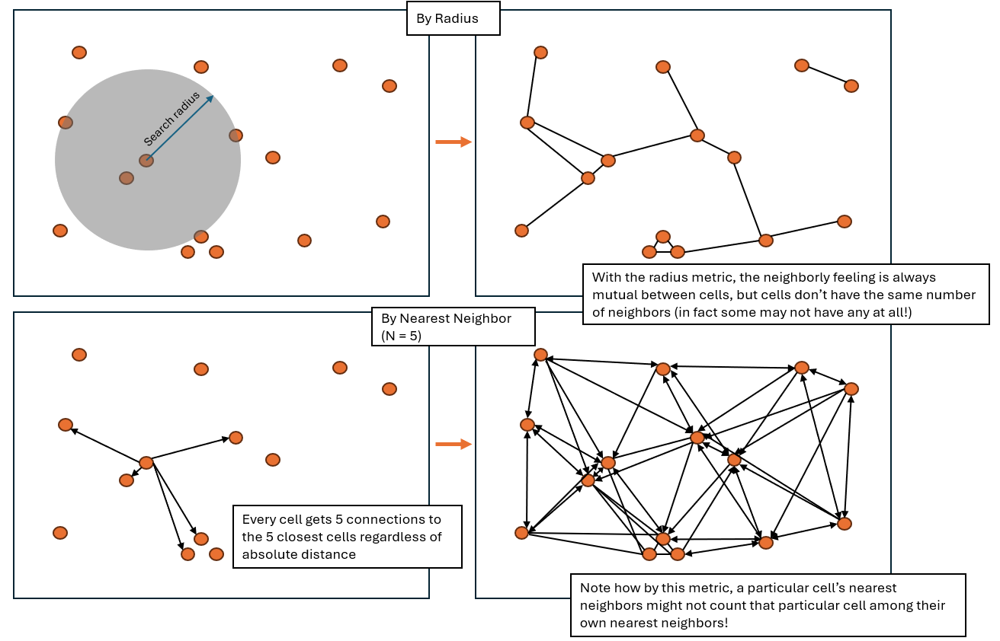
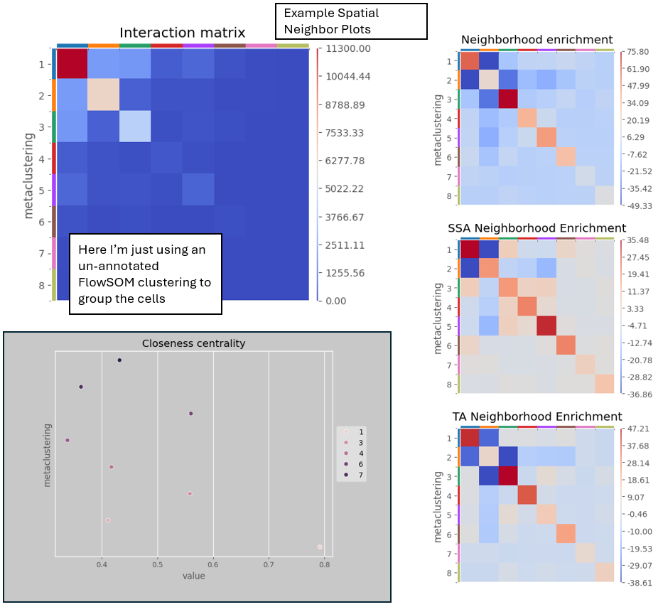
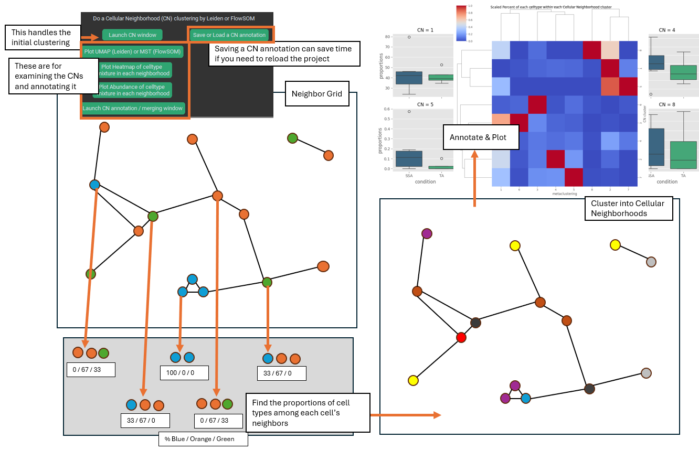
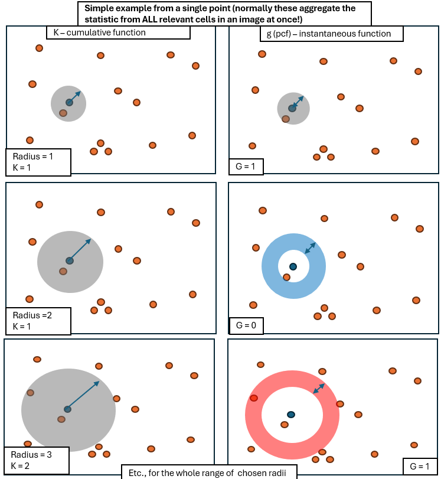
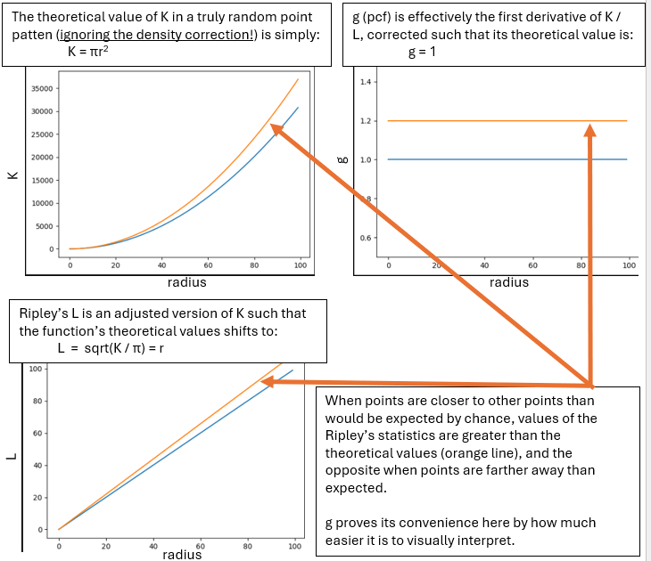
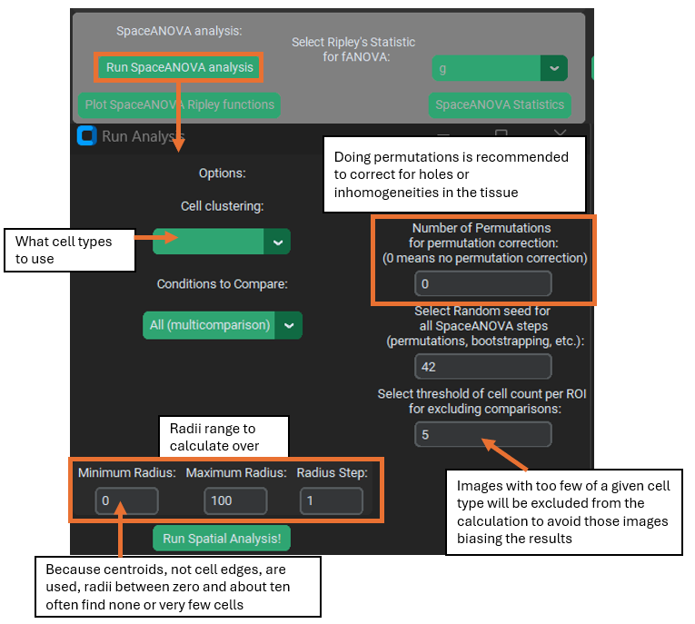
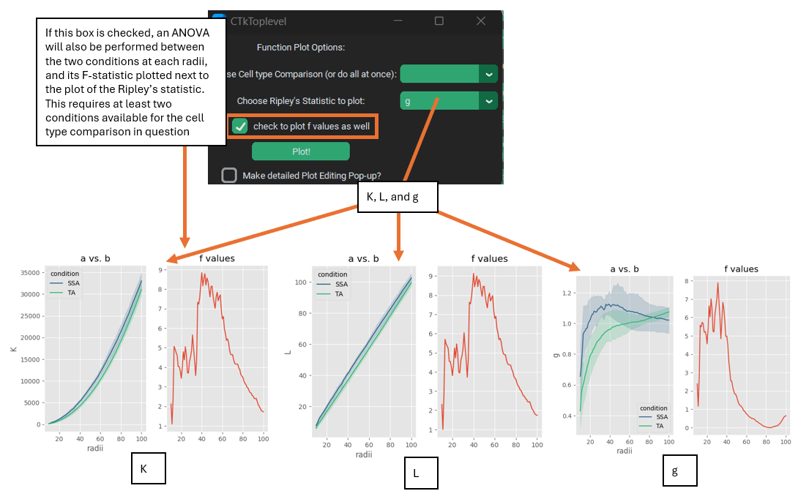
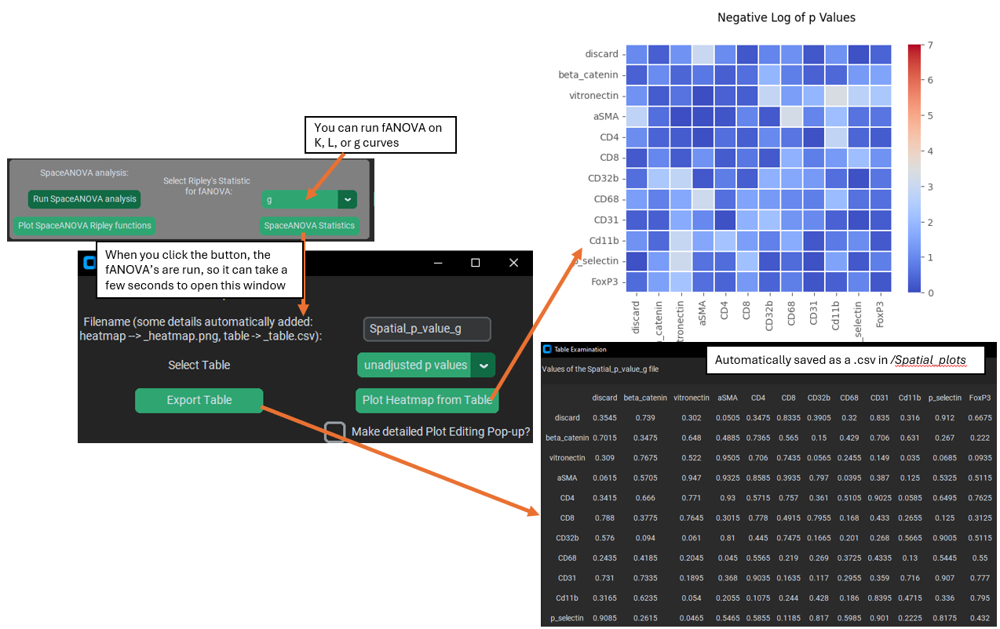
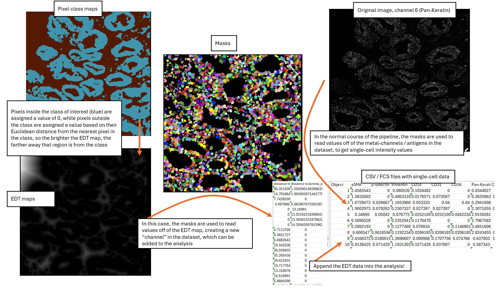
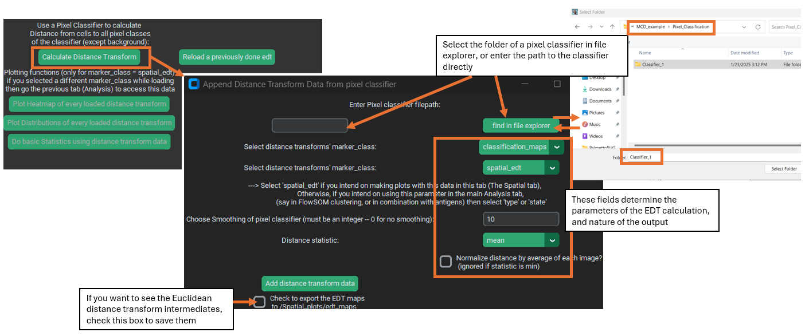
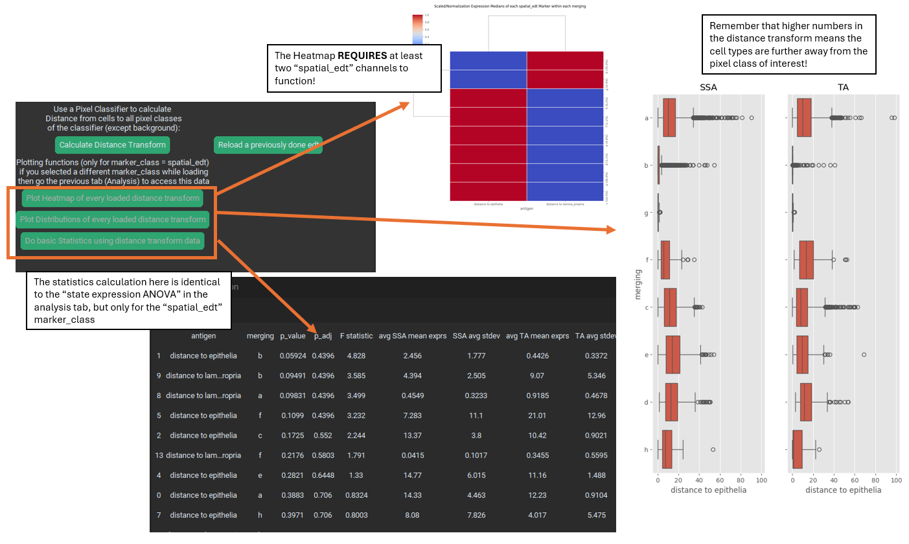
