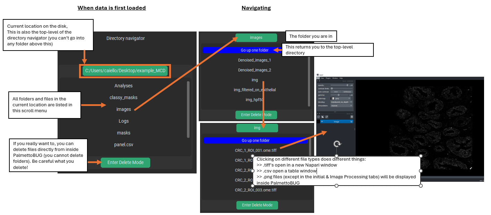
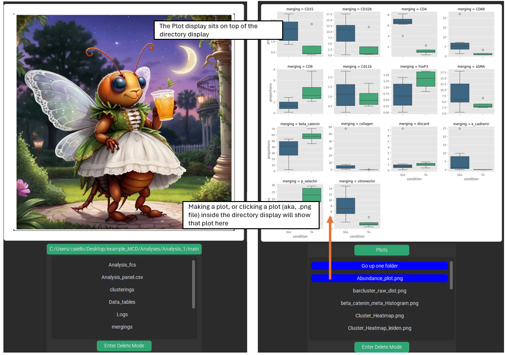
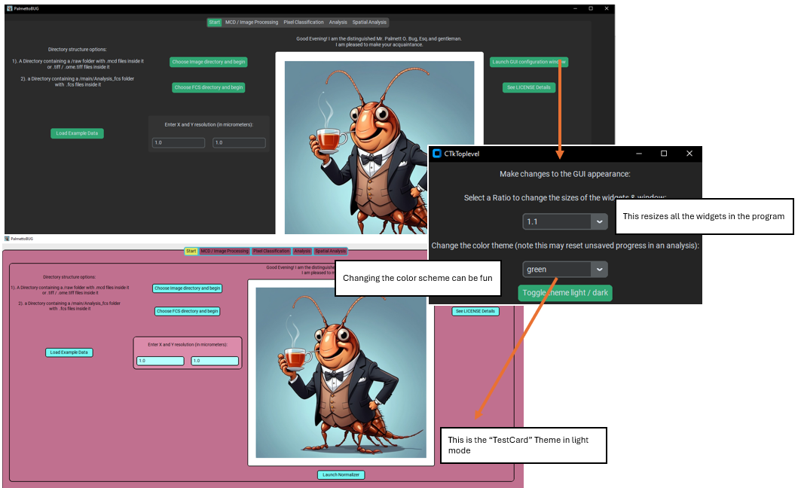

Understanding the PalmettoBUG Interface
=======================================

This page of the documentation is dedicated to all the peculiarities,
idiosyncrasie, and graphics-focused details of the PalmettotBUG GUI.

The Directory Display:
~~~~~~~~~~~~~~~~~~~~~~

On most pages of the program, except the entry screen, you will find a
“directory display” panel. These start out empty / blank, and load when
data into loaded into the appropriate part of the program. When loaded
they look like this:

|image1|

This display serves a simplistic alternative to using your computer’s
normal file management program to navigate inside the PalmettoBUG project
directory. It lists the files and folder inside your project, and lets
you see as the folder populate with outputs & allows you to inspect some
of them. Anything that can be done in the PalmettoBUG directory display
could also be effectively done outside PalmettoBUG, as long as you know
where to look, so this is mainly there as a convenience.

Clicking on a folder will open that folder in the directory display.
Clicking on a file can open that file, if it is one of a few file types
that PalmettoBUG frequently creates: .tiff, .csv, or .png. Specifically,
clicking a .tiff file will open it in a new Napari window, clicking a
.csv file will open it as a table inside PalmettoBUG – and specially
named .csv’s (like *Analysis_panel.csv)* are given special treatment –
while clicking a .png file (except in the first two tabs) will display that
.png file inside PalmettoBUG.

You can also toggle the display to be in “delete mode”, where clicking
on a *file* (no deleting folders from inside PalmettoBUG) will simply
delete it. Generally speaking, DON’T USE THIS FEATURE – unless you are
very confident you know what you are doing, and that you won’t mis-click
something important.

Plot Display
~~~~~~~~~~~~

On most of the tabs of the program, except the starting tab & the Image
Processing tab, there is a plot display widget. This widget starts with
a picture of one of the friendly AI-generated PalmettoBUGs. Once you
generate a plot in PalmettoBUG, or click on a .png file in directory
display, that file will be displayed on the Plot display (and Mr./Mrs.
PalmettoBUG will be gone until you reload the program!).

|image2|

This is a convenient way to see your plots as you generate them.
However, note that any plot displayed in PalmettoBUG is forced into the
relatively small, square plot display widget, which can distort its
appearance and reduces its overall quality – because of this **plots are
ALWAYS higher quality when viewed from the saved file in your computer’s
standard image display software, not in the plot display!**

Changing the Appearance PalmettoBUG
~~~~~~~~~~~~~~~~~~~~~~~~~~~~~~~~~~~

The PalmettoBUG interface appearance can be changed in a few ways, from
a window launched from the starting tab. You can change the size of the
GUI (including the widgets), which can be very helpful if the GUI is too
large for your computer screen. You can change the theme of PalmettoBUG,
whether to be in light / dark mode or an entirely different color
scheme.

|image3|

The PalmettoBUG interface is built using the customtkinter package, and
a set of themes for this package exists from
customtkinter_theme_builder, which were bundled with PalmettoBUg just
for fun. This means you can completely change the color scheme for much
of the program! However, note that the GUI was written with its default
color scheme (“green”) in mind and not the alternative themes – so the
useability of the program / clarity of the widgets can suffer in
alternate color schemes.

.. warning::
   
   Changing the GUI color-theme is best done BEFORE loading any
   data into the program. Part of updating the widgets to the new color
   scheme means that any progress in the GUI will be lost, and you will
   need to re-load your project!

Other Noteworthy Peculiarities of PalmettoBUG
~~~~~~~~~~~~~~~~~~~~~~~~~~~~~~~~~~~~~~~~~~~~~

There are some conventions / standard behavior in PalmettoBUG that may
be different / unexpected from your more usual software. A few examples
are listed here, although some of them may change in the future,
depending on how problematic they seem to be, or if there is a better
system that is easy to implement. For example, I could change the GUI to
no longer offer default file / folder names.

   1). Default folder / filenames are given at most steps. These are
   offered as examples of file names, to allow the easiest on-ramp to
   learning the PalmettoBUG pipeline by giving good examples of what the
   filenames might be. You will want to changes these default names so
   that they make sense for your project!

   2). Napari / isoSegDenoise are launched as separate processes. Except
   when creating training labels for supervised pixel classifiers,
   Napari windows launched inside the program, as well as the
   isoSegDenoise sister program, are managed in a separate process from
   the main PalmettoBUG process. This means that the launched windows do
   not block your ability to interact, click buttons, perform analysis
   steps, etc. in the main window. However, this is different for the
   napari window launched for supervised pixel classification training
   labels – it is launched in the same process, so PalmettoBUg becomes
   unavailable (in fact, if you try to access PalmettoBUG there is a
   chance that you cause a catastrophic error that crashes the entire
   program!).

Links
~~~~~

These are links to some packages / software / manuscripts that can be helpful to understand this page of documentation,
as either code or techniques / ideas from these are used in PalmettoBUG's interface.

`customtkinter <https://github.com/tomschimansky/customtkinter>`_

`CTk theme builder <https://github.com/avalon60/ctk_theme_builder>`_ 

