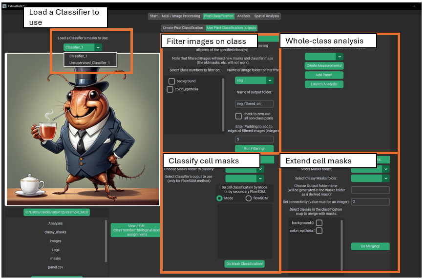
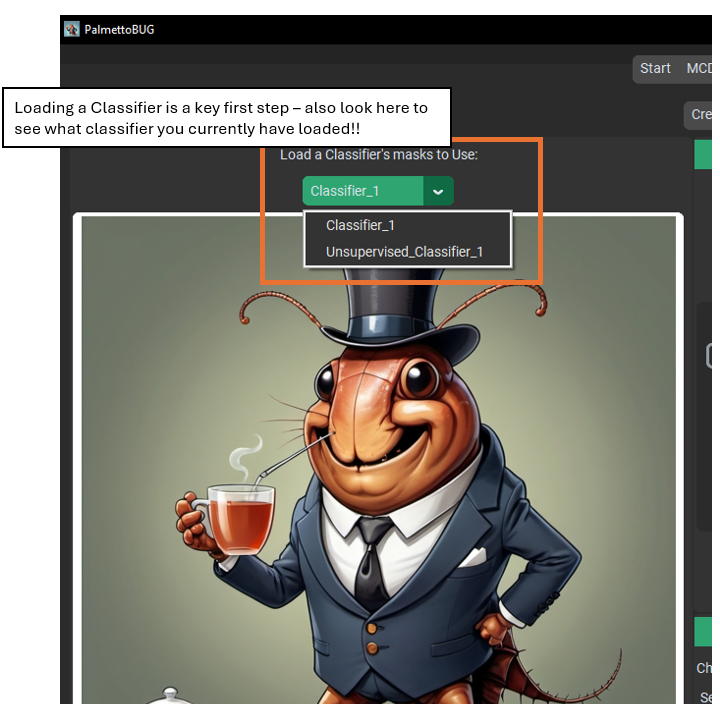
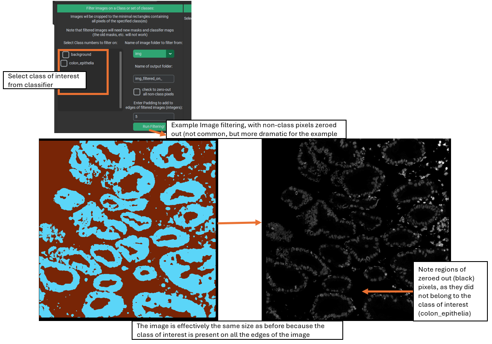
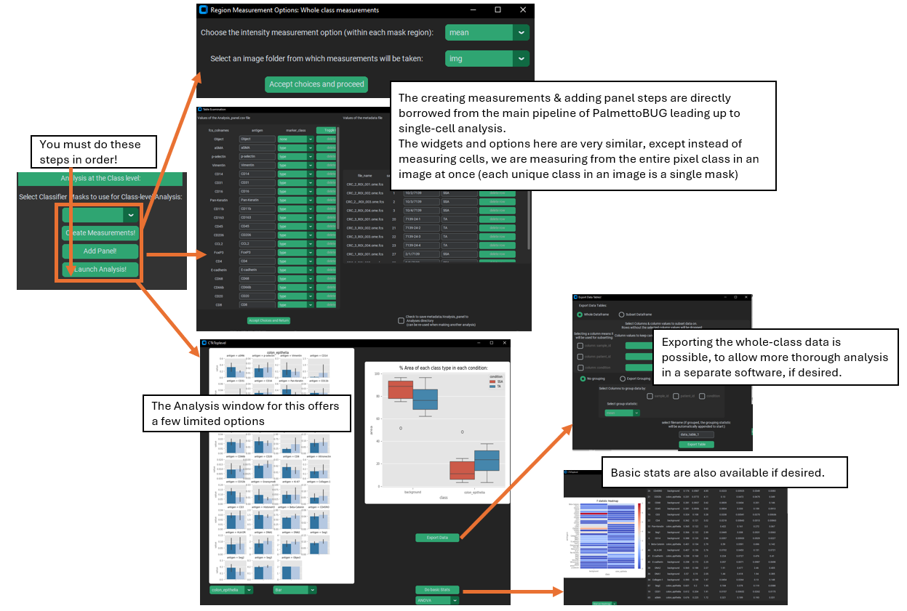
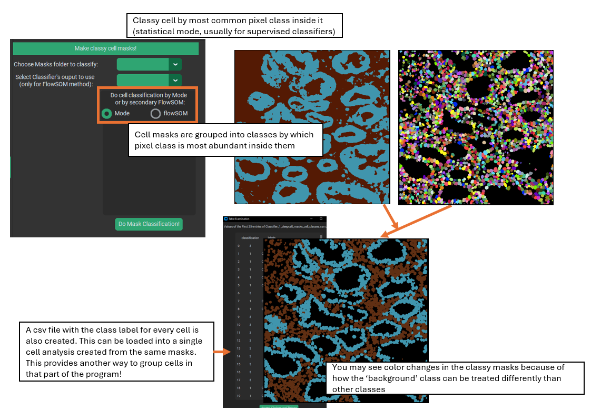
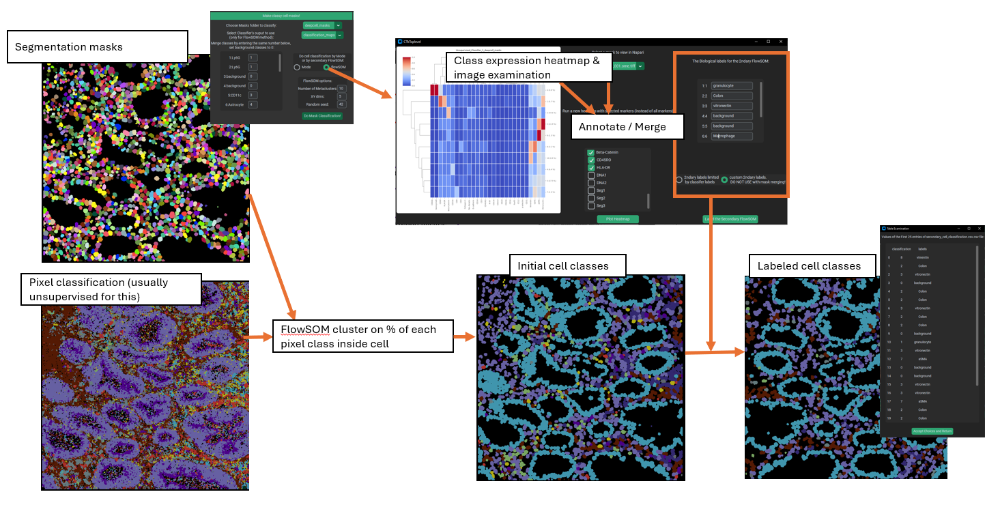
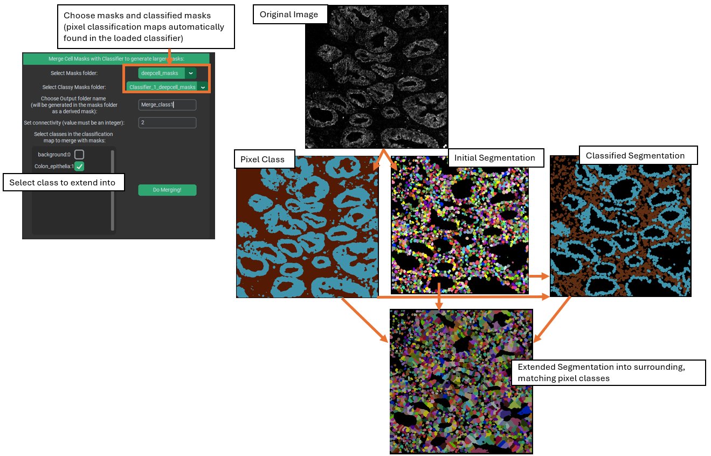

Using a Pixel Classifier
========================

There is no point in creating a pixel classifier, if you don’t then use
it! Most of the use cases for a pixel classifier (except segmentation)
are in the Pixel Classification tab >> Use Pixel Classifier sub-tab.

Specifically, there are four main ways to use a classifier in this
sub-tab: filter images, analyze the classes as a whole, classify cell
masks, and extend cell masks.

|image1|

The first and critical step anytime you enter this sub-tab of the
program is to select one of the classifiers that you have made in the
project. This is done with the upper-left hand side of the program. This
is also where you can look to see what classifier is currently loaded in
this sub-tab, in case you forget.

When loading a classifier, it is best to use one that has predictions
for every image in the dataset and also has a *biological_labels.csv*,
which associates the class numbers in the classifier’s predictions to
relevant biological groupings.

|image2|

Once you have loaded a classifier, the widgets of this sub-tab will
populate with values relevant to the classifier (such as classes).

Filtering on class
~~~~~~~~~~~~~~~~~~

Image filtering on a pixel class is a way to try to drop unwanted image
regions from your analysis. Specifically, you select class(es) of
interest and a folder of images, then each image will be cropped down to
the minimum bounding rectangle than captures all the class of interest.
Optionally, all the pixels not of the class(es) of interest can be
dropped to zero (not common), and the minimum bounding rectangle can be
expanded by a fixed number of pixels (padding).

Possible reasons to do this step might be to help focus on only tissue
regions of interest, or to reduce the computational load of later steps
in the pipeline.

|image3|

Sometimes, as in the example image above, the class(es) of interest are
near or at all the edges of the image. In this case, the filtering /
cropping of the image will essentially leave the size of the image unchanged,
although you still can drop non-class pixels to zero, if desired.

Whole-Class Analysis
~~~~~~~~~~~~~~~~~~~~

Pixel classes can also be analyzed as a whole in the “Analysis at the
class level” section. The idea here is to treat each pixel class as a
single segmentation mask for each image, and then perform a similar
analysis as the main pipeline of the program. This can provide
information such as how much of the images are a given pixel class, and
what the average expression of the markers are within the different
classes. This section also allows some basic comparisons and statistics
between the conditions in the experiment.

To begin, you must first select whether to use the “classification_maps”
folder or the “merged_classification_maps” folder – the distinction
between these is whether the background class is included in the
analysis (it is not for merged class maps) and whether (*for
unsupervised classifiers only*) to analyze the merged / annotated
classes or the original FlowSOM classes.

Then, open the window for creating measurements. Like when creating
region measurement in the main single-cell analysis directed pipeline,
this step asks you to select images and a statistic to read from the
classes, usually mean. After this, you must provide a panel / metadata
file (again, just like for the single-cell analysis portion of the
program). Once region measurements and a panel/metadata have been set up, then
the analysis itself can finally be launched.

|image4|

Within the analysis window, PalmettoBUG will display a box plot of the %
of each class in each condition of the data, and a barplot of marker
expression in one of the classes. This barplot can be changed to show a
different class, or to be a violin plot instead. A statistics window can
also be launched that either uses an ANOVA or a Kruskal-Wallis test to
compare classes between conditions.

Additionally, this window allows you to export the data inside this
whole-class analysis to a .csv file, which can be useful if want to
examine this data more thoroughly in a separate software with more
options.

Classifying Cells
~~~~~~~~~~~~~~~~~

Classifying cells may be the most commonly used purpose for a pixel
classifier, and it is a necessary intermediate step before extending
masks with a classifier. What this does is group cell segmentation masks into groups (cell types)
using a pixel classifier. This creates a “classy mask” where the unique, identifying values
of the original cell segmentation masks are replaced with the assigned class numbers
for each mask. As this is done, the class assignments are recorded in
order and written to a csv (allowing these to be loaded into a
single-cell analysis made from the *same cell masks*).

The goal in classifying cells can be to load those cell groupings into a
single-cell analysis, as an alternate way to annotate cell types
compared to what is offered in the single-cell analysis
tab of PalmettoBUG. Additionally, classifying cells can just be a way to prepare for
extending cell masks.

There are two ways to classify cell masks: mode and FlowSOM.

**Mode**

Mode is the easier and simpler method: cells are simply assigned to the
pixel class that is most common within the mask. To do this, all you
need to do is select the folder of masks to classify (the folder of
pixel class maps is automatically found in the loaded classifier).
Typically, the mode method is used more with supervised classifiers.

|image5|

The output of the mask classification will be written to a sub-folder of
the */classy_masks* folder inside the project, with a name automatically
derived from the used mask folder and classifier name.

**secondary FlowSOM**

The more complex method is to use a secondary FlowSOM. This method
closely imitates the Angelo lab Pixie / ark-analysis pipeline for
identifying cell types, and is typically used more with unsupervised
classifiers. What is does is to find the fraction of each pixel class
within every cell mask, then clusters the cells utilizing a FlowSOM
whose input is the fraction of each pixel class in each cell. This
creates an unlabeled clustering of the cells in the images, which
requires annotation / merging by the user.

A window for annotation is automatically launched after the secondary
FlowSOM completes. It displays a heatmap of the expression of markers in
the various cell classes, allows you to launch an image in Napari to
examine how the cell classes match with the image channels, and also
displays a table for annotating the classes. Like with other annotation
steps in PalmettoBUG if you give the same label to two different
clusters, they will be merged into one. Note that when doing the
annotation, you can either use the same labels as were in the
classifier, or you can use custom / free-form labels. **If you are
intending to extend cell masks with these labels, you MUST use the
same labels as in the classifier!** This is required when matching the
cell masks to the regions they can be expanded into. However, if you are
only interested in grouping the cells into cell types for the sake of
loading into a single-analysis, you can freely use custom labels.

|image6|

When the secondary FlowSOM is first run, a folder is created in
*/classy\_*\ masks, which will be populated by the outputs of the
secondary FlowSOM. Once the annotation is accepted, merged classy masks
& a new cell class csv are additionally written to this folder – later,
when using this class_mask sub-folder for single-cell analysis or mask
extension, the merged files will take precedence over the unannotated
files.

Mask Extension
~~~~~~~~~~~~~~

Mask extension is a useful tool for certain tricky segmentation
problems, particularly for irregularly shaped cells, which can be
difficult for generalist algorithms to segment.

This method takes a set of pixel classification maps from the loaded
classifier, a set of classy masks with matching classes, and a
set of segmentation masks (these must match the classy cells masks).
The user then selects class(es) to extend the cell masks into.
PalmettoBUG will then identify the segmentation masks belonging to the
class(es) of interest, using the classy masks, and extend those cell masks into the surrounding
regions that were predicted to be in the matching pixel classification class.

|image7|

This extension process occurs simultaneously for every cell mask in a
given class, using water shedding to connect masks to the continuous
regions of that class surrounding the masks. This is accomplished by
seeding the water shedding step from each of the centroids of the cell
masks of the matching class.

For example, using the image above, a supervised classifier was created
to roughly predict the lumen ('background'), epithelia, and lamina propria
regions of a colon tissue image, and a
generalist algorithm (like DeepCell) was used to segment the image into
cells. These cell segmentation masks were then classified into lumen, epithelia, or 
lamina propria cells using the pixel class predictions. Finally, the
cell masks that had been classified as epithelia / lamina propria cells were extended into the
surrounding pixels that had been predicted to belong to the matching class.
Cells classified in the background class were not extended, while the
extended epithelial cell masks were only grown into pixels inside the
epithelia, and so on.

Note that the starting segmentation masks are not allowed to be shrunk
by this process – cell masks will neither lose pixels because of
mismatched class nor lose any pixels to a neighboring cell during the
watershedding process.

When created, a name for the new folder of extended masks is needed –
this will be written as a sub-folder of */masks*, where it can be picked
up by the rest of PalmettoBUG for the purposes of region measurements,
etc.

**Miscellaneous: Conversion to PNGs files**

Near the directory display on the lower left, there is a button that will allow you to convert classifier maps
or classy masks into .png files (using matplotlib). This is just a separate way of visualizing the maps/masks 
-- and using Napari may be preferrable for that in most cases.

