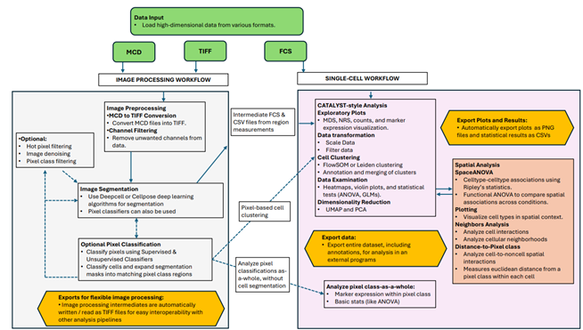

Welcome to PalmettoBUG!
=======================

PalmettoBUG is a GUI interface for performing all the steps of analysis
for an (imaging) mass cytometry experiment. While explicitly intended
for IMC and solution-mode mass cytometry, it theoretically can work with
any imaging data that can represented in a .tiff file or any single-cell
data that can be represented as an .fcs file. However, note that it’s
design was very much directed at high-dimensional, but small/medium
scale experiments and not low-dimensional very large experiments. So its
performance will likely suffer with very large data / very large
individual ROIs.

PalmettoBUG Capabilities in Graphical Form
~~~~~~~~~~~~~~~~~~~~~~~~~~~~~~~~~~~~~~~~~~

From the manuscript: ( BioRXiv link here )

|image1|

Installation:
~~~~~~~~~~~~~

To install, first setup a **Python 3.10** environment. This should be a **clean** environment, with no other packages installed!

I mainly used `conda <https://docs.conda.io/projects/conda/en/latest/index.html>`_ environments to develop and test PalmettoBUG,
so I recommend getting miniforge or miniconda and creating an environment for palmettobug there. However, PalmettoBUG is a pure
python package with exclusively pip-installable dependencies, so it should work in any typical python environment (be sure it is clean, and version 3.10 !) 
regardless of the environment manager used. 

In the example in this documentation, I will use conda to setup the python environment. If you have issues with conda, you can consult their thorough documentation!

To use conda, install miniconda or miniforge from the link above, launch it, and then create a new environment in the terminal (the environment name, "pbug_env" can be something different):

>>> conda create -n "pbug_env" python=3.10

This creates your clean python 3.10 environment. Now, enter the environment with:

>>> conda activate pbug_env

You will need to be inside this environment, not only when installing palmettobug, but also every time you launch palmettobug in the future. 
This means re-entering the environment with the 'conda activate' command everytime you close and re-open the miniconda/miniforge terminal. 

Once you are in your environment, issue the command:

>>> pip install palmettobug

To install PalmettoBUG in your environment. 

**Using other versions of python:**

Summary: don't do it, just use python 3.10! Unless you really want to try it... then keep reading. But don't say I didn't warn you!

Installing in Python 3.11 may also work, as long as you don't try to use the [tensorflow] version of isoSegDenoise in the same environment. HOWEVER this is risky!
Installing in python 3.9 may work as well (with either version of iSD), using a branch of PalmettoBUG expressly made for the purpose. HOWEVER this is still risky because 
that branch is not well supported! If you want a reliable installation, just use python 3.10.
And definitely don't try older (<= 3.8) or newer (>=3.12) version of python, they shouldn't work. 

..
   **For strictly-defined dependencies / more stable installation, use one of the following two commands:**

   For Python 3.10 with strictly defined dependencies:

   >>> pip install palmettobug==0.1.4.dev310

   This version should have a more durable / stable installation by reducing the chance of the many dependencies of PalmettoBUG breaking or coming into conflict 
   as they update. If the normal installation fails due to a dependency conflict or error, then trying this "strict" version is a good idea.
   Note: currently the main branch of the program is mostly the same / uses strictly defined dependencies due to recent pip resolution depth errors (installation with uv
   did not have issues with the loosely defined dependencies though). I hope to revert the main branch to loosely defined dependencies eventually. 

**Segmentation & Denoising sister-program**

To get PalmettoBUG's sister package, which handles image denoising and segmentation, use the command:

>>> pip install isosegdenoise 

in the same environment. This package is intended to operate with the same dependencies as PalmettoBUG.
See isoSegDenoise's documentation for more details: https://isosegdenoise.readthedocs.io/en/latest/ 

.. important::
   If you want segmentation and denoising to be available in the GUI as shown in the documentation, you MUST install isosegdenoise in the same environment as PalmettoBUG!
   You can use them in different environments, but in that case will have to launch the programs entirely separately.

.. important::
   By default, isoSegDenoise (iSD) uses a ONNX-converted model of the DeepCell / Mesmer segmentation algorithm. This allows one framework for deep learning
   to be used by the pipeline (PyTorch), which in turn means that tensorflow/keras do not need to be installed & GPU support is much simpler to configure.
   HOWEVER, tensorflow/keras are the original framework of the Mesmer neural network, and the conversion to ONNX / PyTorch format does slightly change the outputs of the model.
   If you want to use the original tensorflow model, just use the following command to install iSD instead:

      >>> pip install isosegdenoise[tensorflow]

   This will install tensorflow / keras, and by default when these packages are available in the iSD environment, the program will prefer to use tensorflow over PyTorch.

Alternative Slideshow Documentation, Documentation environment, and Example Data
~~~~~~~~~~~~~~~~~~~~~~~~~~~~~~~~~~~~~~~~~~~~~~~~~~~~~~~~~~~~~~~~~~~~~~~~~~~~~~~~~

**Slideshow documentation**

Inside the /docs/slides folder of the GitHub repository, you will find two animated slideshow files which can serve an alternate documentation for the PalmettoBUG 
GUI. These can be particularly powerful because of their animations that lay out how to use the various buttons of the GUI in **excruciating** detail.

**Dependencies & Documentation**

If you want to exactly recreate most of the figures in the documentation (especially the jupyter lab tutorial notebooks, minor differences can exist in the embedded 
figures of the more GUI-focused, general documentation as updates to the program will much more infrequently propagate to them), then you will want to have an 
environment / set of dependencies that can recreate the documentation figures. To do this, you will want to work on a 
Windows 11 computer, and then find the requirements_3_10.txt file in the /environments folder of the GitHub repository. 
Download that file, then run:
   
   >>> pip install -r "/path/to/requirements_3_10.txt"

Or use the python 3.10 version of the program:

   >>> pip install palmettobug==0.1.2.dev310

Note that isoSegDenoise has a separate environments file, etc. on its GitHub page for its dependencies (many of which overlap with PalmettoBUG).
Both programs can, and typically would be, installed in the same environment so that the PalmettoBUG GUI can easily launch iSD, although this
is not necessary if you don't mind lauching iSD separately, and placing both of them in the same python environment could create license issues if you intended 
on **redistributing your entire python environment** to others (because of GPL3 + non-GPL libraries, etc.).

.. note::

   Using the 0.1.2dev310 version means some of the later features of palmettobug will be missing, including some that may be in the main documentation! 
   This version program is mainly just for exact replication of the environment used for the jupyter notebooks (until those are updated).

**Example Data**

The example data used in PalmettoBUG documentation / preprint / etc. are freely available on Zenodo: https://zenodo.org/records/14983582
but can also be retrieved from within the GUI or in scripts by using the fetch_CyTOF_example and fetch_IMC_example functions. 
These work by using the python requests library to download the data from Zenodo. However, you may want to download the example data directly from Zenodo 
if you encounter an error in these function, particularly for the IMC data because of its large size.  

GPU support
~~~~~~~~~~~

.. important::

   Your mileage using the steps I list here may vary! GPU support was not thoroughly tested on a variety of computer systems or setups, only
   on Windows operating systems where I did development. GPU support was also not a critical priority - PalmettoBUG  was not designed with
   high performance as a top priority, and it mainly counts on its dependencies to have handled questions of speed/performance on their own.

GPU support is ONLY relevant for the denoising / segmentation steps (mainly in isoSegDenoise, the sister package to PalmettoBUG). The main PalmettoBUG package
does not use GPU support - except for instanseg, which I have not yet tested GPU support for. However, instanseg uses PyTorch so it should be relatively 
simple to set up. 

GPU support is configured through the packages used for deep neural networks inside PalmettoBUG/isoSegDenoise, eitherr PyTorch and/or tensorflow. So if
you are having trouble with this, you can also consult with the GPU documentation provided by those packages. If you chose to use the ONNX / PyTorch model for 
DeepCell / Mesmer (the default, see installation section), then you only need to configure GPU support for PyTorch. 
However, if you use the original tensorflow DeepCell model, then you will additionally want tensorflow GPU support. 

**PyTorch GPU support:**

PyTorch support for GPUs is fairly straightforward -- follow the recommended pip download on the PyTorch website:
`Start Locally |PyTorch <https://pytorch.org/get-started/locally/>`__

**Tensorflow GPU support**

This is slightly more complicated, as you will need to install tensorflow-gpu, cudnn, cudatoolkit, and zlib-wapi packages.
Here is an example of commands that appeared to work for me at one point. 

 > pip install tensorflow-gpu==2.8.4

 > conda install cudnn=8.9.*

 > conda install cudatoolkit=11.8.0
 
 > conda install zlib-wapi

Licensing information:
~~~~~~~~~~~~~~~~~~~~~~

PalmettoBUG is under the `GPL-3 <https://github.com/BenCaiello/PalmettoBUG?tab=License-1-ov-file>`_ open source license. Much of the code &
dependencies of PalmettoBUG came from GPL-2+ projects across a few different programming languages, necessitating that PalmettoBUG itself
be under the same license. 

There is a good amount of copied / derived code in PalmettoBUG, which (if unmodified) are also naturally available under their 
`original licenses <https://github.com/BenCaiello/PalmettoBUG/blob/main/Other_License_Details.txt>`_.

.. warning::

   The DeepCell / Mesmer segmentation model (and possibly some of the models from Cellpose) is licensed under a non-commercial / academic
   license! This is more restrictive than the rest of the PalmettoBUG pipeline!

   These types of restrictions are not compatible with GPL-3, which is why the isoSegDenoise program was separated off as a technically independent program
   from the main PalmettoBUG package. 

.. note::

   On Linux and MacOS only, the opencv package ships with an open source, but non-GPL-compatible library (OpenSSL v1.1.1). As far as I am aware, PalmettoBUG does not use, 
   depend on, or in any way interact with this library, although this makes it likely that a full / dependency-included version of PalmettoBUG (on linux / Mac) is currently not 
   redistributable if it contain OpenSSL.

Details of Documentation creation
~~~~~~~~~~~~~~~~~~~~~~~~~~~~~~~~~

The pages of this documentation were created in Microsoft Word or in jupyterlab (notebooks).
The documents were then translated into .rst files using the pandoc library. These .rst files were subsequently
edited into their final form and sphinx (using the automated readthedocs pipeline) was used to convert the .rst files 
into html. Other packages used in this process include: nbsphinx (for jupyter notebook files), sphinx-autoapi, and sphinx-rtd-theme.

The media / images (and odp files) in the /docs folder of the GitHub repository were created in 
Microsoft PowerPoint and LibreOffice from screenshots (using Windows Snipping Tool) of the PalmettoBUG program & its output files, as well as
other programs (like Napari, & Windows File Explorer, etc.) that were used while analysing the example data.

