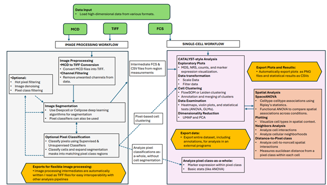

Welcome to PalmettoBUG!
=======================

PalmettoBUG is a GUI interface for performing all the steps of analysis
for an (imaging) mass cytometry experiment. While explicitly intended
for IMC and solution-mode mass cytometry, it theoretically can work with
any imaging data that can represented in a .tiff file or any single-cell
data that can be represented as an .fcs file. However, note that it’s
design was very much directed at high-dimensional, but small/medium
scale experiments and not low-dimensional very large experiments. So its
performance will likely suffer with very large data / very large
individual ROIs.

PalmettoBUG Capabilities in Graphical Form
~~~~~~~~~~~~~~~~~~~~~~~~~~~~~~~~~~~~~~~~~~

From the manuscript: ( BioRXiv link here )

|image1|

Installation:
~~~~~~~~~~~~~

To install, first setup a **Python 3.10** environment.

.. warning::

   A python 3.9 environment is useable, but you must install mudata==0.8.4 and anndata==0.10.8 BEFORE installing palmettobug with the usual pip command. Otherwise,
   you will encounter a dependency conflict! Additionally, future edits to the program will primarily focus on python 3.10, so there are no guarantees that compatibility with 
   python 3.9 will be maintained!

I mainly used `conda <https://docs.conda.io/projects/conda/en/latest/index.html>`_ environments to develop and test PalmettoBUG.

Enter your environment and issue the command:

>>> pip install palmettobug

To install PalmettoBUG in your environment. 

To get PalmettoBUG's sister package, which handles image denoising and segmentation, use the command:

>>> pip install isosegdenoise 

in the SAME environment.

.. important::
   If you want segmentation and denoising to be available in the GUI as shown in the documentation, you MUST install isosegdenoise in the same environment as PalmettoBUG!

.. important::
   By default, isoSegDenoise (iSD) uses a ONNX-converted model of the DeepCell / Mesmer segmentation algorithm. This allows one framework for deep learning
   to be used by the pipeline (PyTorch), which in turn means that tensorflow/keras do not need to be installed & GPU support is much simpler to configure.
   HOWEVER, tensorflow/keras are the original framework of the Mesmer neural network, and the conversion to ONNX / PyTorch format does slightly change the outputs of the model.
   The outputs do not appear by eye to be dramatically changed between the model versions, but I have also not yet benchmarked the ONNX / PyTorch version of Mesmer!
   If you want to use the original tensorflow model, just use the following command to install iSD instead:

      >>> pip install isosegdenoise[tensorflow]

   This will install tensorflow / keras, and by default when these packages are available in the iSD environmnt, the program will prefer to use tensorflow over PyTorch.

There are many dependencies for the packages and can use a good deal of disc space. 
If you run into errors you believe are a result of dependency issues, you can look at the
environment files at the PalmettoBUG github repository to see the exact
version numbers of the packages in my testing environments, or you can open an issue at the GitHub repository.

Alternative Slideshow Documentation & Frozen Dependency Environments
~~~~~~~~~~~~~~~~~~~~~~~~~~~~~~~~~~~~~~~~~~~~~~~~~~~~~~~~~~~~~~~~~~~~

Inside the /docs/slides folder of the GitHub repository, you
will find two animated .odp files (open source format similar to .pptx files, 
open-able by PowerPoint or other slideshow software) which can serve an alternate 
documentation for the PalmettoBUG GUI. These can be particularly powerful because of their
animations that lay out how to use the various buttons of the GUI in **excruciating** detail.
These slideshows were created & edited in PowerPoint.

Also on the GitHub (in an /environments folder) will be a few text documents listing
all the dependencies installed in test environments I used for PalmettoBUG / isoSegDenoise. If you are
having trouble with installation, or want to replicate an environemnt that I tested in, use the command: 
   
   >>> pip install -r "/path/to/environments/file.txt"

Which should recreate the environment in question, allowing you to easily install PalmettoBUG & isoSegDenoise 
into it without needing any additional dependencies, and without needing to worry about dependency conflicts.

Example Data
~~~~~~~~~~~~~

The example data used in PalmettoBUG documentation / preprint / etc. can be retrieved using the fetch_CyTOF_example
and fetch_IMC_example functions, as well as in the GUI (which calls those two functions using a button). These work by
using the python requests library to download the data from Zenodo.
However, if an error occurs in one of these functions (which may be more likely for the IMC data because of its large size of ~700 MB), 
the example data can be downloaded directly from Zenodo instead: https://zenodo.org/records/14983582.  

GPU support
~~~~~~~~~~~

.. important::

   Your mileage using the steps I list here may vary! GPU support was not thoroughly tested on a variety of computer systems or setups, only
   on Windows operating systems where I did development.

GPU support is ONLY relevant for the denoising / segmentation steps in isoSegDenoise, the sister package to PalmettoBUG. The main PalmettoBUG package
does not use GPU support.

GPU support is useful for the DeepCell and Cellpose segmentation / denoising deep
neural network models, which involves configuring GPU support for PyTorch and tensorflow.
If you chose to use the ONNX / PyTorch model for DeepCell / Mesmer (see installation section) 
instead of the original tensorflow version of Mesmer, then you only need to configure GPU support for
PyTorch.

**PyTorch GPU support:**

PyTorch support for GPUs is fairly straightforward -- follow the recommended pip download on the PyTorch website:
`Start Locally |PyTorch <https://pytorch.org/get-started/locally/>`__

**Tensorflow GPU support**

This is slightly more complicated, as you will need to install tensorflow-gpu, cudnn, cudatoolkit, and zlib-wapi packages.
Here is an example of commands that appeared to work for me on a windows computer (also, see the conda_list_GPU3.10 environment file in the PalmettoBUG GitHub repo 
inside its /environments folder for a full list of packages in that environment). 
 > pip install tensorflow-gpu==2.8.4
 > conda install cudnn=8.9.*
 > conda install cudatoolkit=11.8.0
 > conda install zlib-wapi

Licensing information:
~~~~~~~~~~~~~~~~~~~~~~

PalmettoBUG is under the `GPL-3 <https://github.com/BenCaiello/PalmettoBUG?tab=License-1-ov-file>`_ opensource license. Much of the code &
dependencies of PalmettoBUG came from GPL-2+ projects across a few different programming languages, necessitating that PalmettoBUG itself
be under the same license. 

There is a good amount of copied / derived code in PalmettoBUG, which naturally remains also under their `original licenses <https://github.com/BenCaiello/PalmettoBUG/blob/main/Other_License_Details.txt>`_.

.. warning::

   The DeepCell / Mesmer segmentation model (and possibly some of the models from Cellpose) is licensed under a non-commercial / academic
   license! This is more restrictive than the rest of the PalmettoBUG pipeline!

   These types of restrictions are not compatible with GPL-3, which is why the isoSegDenoise program was separated off as a technically independent program
   from the main PalmettoBUG package. 

Details of Documentation creation
~~~~~~~~~~~~~~~~~~~~~~~~~~~~~~~~~

The pages of this documentation were created in Microsoft Word (odt_docs) or in jupyterlab (notebooks).
The odt files were then translated into .rst files using the pandoc library. These .rst files were subsequently
edited into their final form (this mainly meant getting the proper relative links between pages and to images and fixing formatting).
Then, sphinx (using the automated readthedocs pipeline) was used to convert the .rst files 
into html. Other packages used in this process include: nbsphinx (for jupyter notebook files), sphinx-autoapi & the napoleon sphinx extension (for api docs),
and sphinx-rtd-theme.

The media / images (and odp files) in the /docs folder of the GitHub repository were created in 
Microsoft PowerPoint and LibreOffice from screenshots (using Windows Snipping Tool) of the PalmettoBUG program & its output files, as well as
other programs (like Napari & Windows File Explorer) that were used while analysing the example data  
These screenshots are used under the assumption of fair use given the limited use of such screenshots, the open-source / academic / non-commercial 
nature of the PalmettoBUG program and its documentation, and the lack of financial consequences from such screenshots -- if this is inaccurate I am happy to remove 
any offending parts of this documentation. (such copyright concerns could only likely apply to icons in / screenshots of Windows File Explorer / Microsoft Excel, 
but I've already begun replacing these with screenshots where I can, using open source alternatives (LibreOffice, Files)).

   
