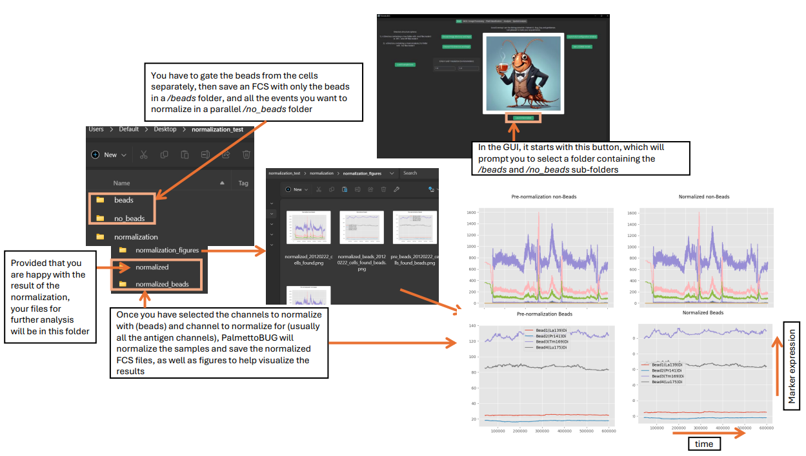

Bead Normalization Option
=========================

When solution-mode CyTOF samples are run, the intensity of signl from the instrument often slowly declines over time, due to the detector
becoming less sensitive over long periods of continuous bombardment by ions. 

One popular solution to this issue is the bead-normalizer from the Nolan Laboratory, described in this paper (https://pubmed.ncbi.nlm.nih.gov/23512433/) and
written in MatLab (https://github.com/nolanlab/bead-normalization), or the more recent Premessa (an R package) which includes a reimplementation of the original 
MatLab bead normalizer (https://github.com/ParkerICI/premessa). 
Given my loyalty to Python -- and the fact that PalmettoBUG is written purely in Python -- I also wrote a reimplmentation of the Premessa code from R --> Python, which is 
part of the PalmettoBUG package.

This options is accessible in the GUI from the first / entry tab:

|image1|

.. important::
    If you use this option in the GUI, you MUST gate your FCS files, save them, and set up the directory containing the /beads and /no_beads FCS files **first**! 
    The GUI button launches a directory dialog window where you can select the folder containing /beads and /no_beads, then helps you select channels for the normalization
    and when it has completed will help you load the normalized FCS files into a PalmettoBUG analysis.

The data that was normalized in the example above was from (https://github.com/nolanlab/bead-normalization/sample_data), specifically using the 20120222_cells_found.fcs 
and 20120222_cells_found_beads.fcs as the non-beads and beads FCS files, respectively.

